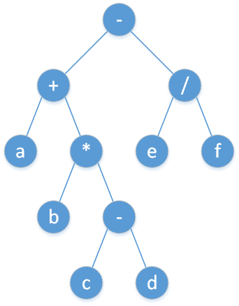

表达式求值要解决的问题一般是输入一个字符串表示的表达式，要求输出它的值。当然也有变种比如表达式中是否包含括号，指数运算，含多少变量，判断多个表达式是否等价，等等。

其中判断表达式等价的部分使用了拉格朗日插值法等数学工具，在此暂不进行展开。

一般的思路分为两种，一种递归一种非递归。

## 递归

递归的方法是把表达式拆分成如图所示的表达式树，然后在树结构上自底向上进行运算。

## 非递归

非递归的方法是定义两个栈来分别存储运算符和运算数。每当遇到一个数直接放进数的栈；每当遇到一个操作符时，要查找之前运算符栈中的元素，按照预先定义好的优先级来进行适当的弹出操作（弹出的同时求出对应的子表达式的值）。
