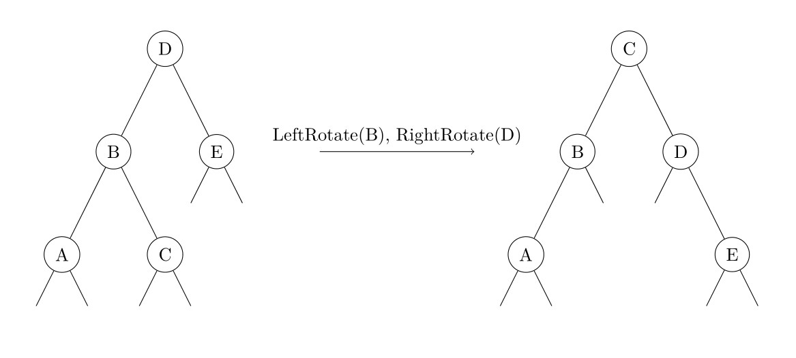

AVL 树，是一种平衡的二叉搜索树。由于各种算法教材上对 AVL 的介绍十分冗长，造成了很多人对 AVL 树复杂、不实用的印象。但实际上，AVL 树的原理简单，实现也并不复杂。

## 性质

1.  空二叉树是一个 AVL 树
2.  如果 T 是一棵 AVL 树，那么其左右子树也是 AVL 树，并且 $|h(ls) - h(rs) \leq 1|$ ，h 是其左右子树的高度
3.  树高为 $O(\log n)$ 

平衡因子：右子树高度 - 左子树高度

 **树高的证明** 设 $f_n$ 为高度为 $n$ 的 AVL 树所包含的最少节点数，则有

$$
\begin{aligned}
   f_1&=1\\
   f_2&=2\\
   f_n&=f_{n-1}+f_{n-2}\quad (n>2)
\end{aligned}
$$

显然 $f_n$ 是一个斐波那契数列。众所周知，斐波那契数列是以指数的速度增长的，因此 AVL 树的高度为 $O(\log n)$ 。

## 插入结点

与 BST（二叉搜索树）中类似，先进行一次失败的查找来确定插入的位置，插入节点后根据平衡因子来决定是否需要调整。

## 删除结点

删除和 BST 类似，将结点与后继交换后再删除。

删除会导致树高以及平衡因子变化，这时需要沿着被删除结点到根的路径来调整这种变化。

## 平衡的维护

插入或删除节点后，可能会造成 AVL 树的性质 2 被破坏。因此，需要沿着从被插入/删除的节点到根的路径对树进行维护。如果对于某一个节点，性质 2 不再满足，由于我们只插入/删除了一个节点，对树高的影响不超过 1，因此该节点的平衡因子的绝对值至多为 2。由于对称性，我们在此只讨论左子树的高度比右子树大 2 的情况，即下图中 $h(B)-h(E)=2$ 。此时，还需要根据 $h(A)$ 和 $h(C)$ 的大小关系分两种情况讨论。需要注意的是，由于我们是自底向上维护平衡的，因此对节点 D 的所有后代来说，性质 2 仍然是被满足的。


###  $h(A)\geq h(C)$ 

设 $h(E)=x$ ，则有

$$
h(B)=x+2\\
h(A)=x+1\\
x\leq h(C)\leq x+1
$$

其中 $h(C)\geq x$ 是由于节点 B 满足性质 2，因此 $h(C)$ 和 $h(A)$ 的差不会超过 1。此时我们对节点 D 进行一次右旋操作（旋转操作与其它类型的平衡二叉搜索树相同），如下图所示。


显然节点 A、C、E 的高度不发生变化，并且有

$$
0\leq h(C)-h(E)\leq 1\\
x+1\leq h'(D)=\max(h(C),h(E))+1=h(C)+1\leq x+2\\
0\leq h'(D)-h(A)\leq 1
$$

因此旋转后的节点 B 和 D 也满足性质 2。

###  $h(A)<h(C)$ 

设 $h(E)=x$ ，则与刚才同理，有

$$
h(B)=x+2\\
h(C)=x+1\\
h(A)=x
$$

此时我们先对节点 B 进行一次左旋操作，再对节点 D 进行一次右旋操作，如下图所示。



显然节点 A、E 的高度不发生变化，并且 B 的新右儿子和 D 的新左儿子分别为 C 原来的左右儿子，则有

$$
x-1\leq h'(rs_B),h'(ls_D)\leq x\\
0\leq h(A)-h'(rs_B)\leq 1\\
0\leq h(E)-h'(ls_D)\leq 1\\
h'(B)=\max(h(A),h'(rs_B))+1=x+1\\
h'(D)=\max(h(E),h'(ls_D))+1=x+1\\
h'(B)-h'(D)=0
$$

因此旋转后的节点 B、C、D 也满足性质 2。最后给出对于一个节点维护平衡操作的伪代码。

```
Maintain-Balanced(p)
    if h[ls[p]] - h[rs[p]] == 2
        if h[ls[ls[p]]] >= h[rs[ls[p]]]
            Right-Rotate(p)
        else
            Left-Rotate(ls[p])
            Right-Rotate(p)
    else if h[ls[p]] - h[rs[p]] == -2
        if h[ls[rs[p]]] <= h[rs[rs[p]]]
            Left-Rotate(p)
        else
            Right-Rotate(rs[p])
            Left-Rotate(p)
```

与其他平衡二叉搜索树相同，AVL 树中节点的高度、子树大小等信息需要在旋转时进行维护。

## 其他操作

AVL 树的其他操作（Pred、Succ、Select、Rank 等）与普通的二叉搜索树相同。

## 其他资料

在[AVL Tree Visualization](https://www.cs.usfca.edu/~galles/visualization/AVLtree.html)可以观察 AVL 树维护平衡的过程。
