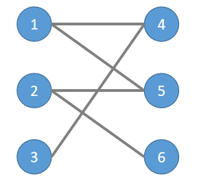
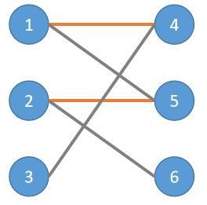
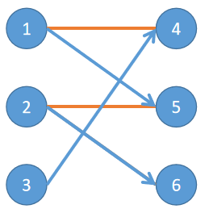
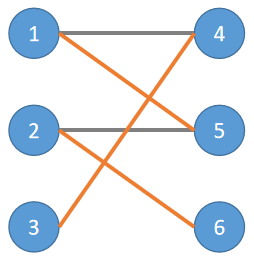

## 定义

二分图，又称二部图，英文名叫 Bipartite graph。

二分图是什么？节点由两个集合组成，且两个集合内部没有边的图。

换言之，存在一种方案，将节点划分成满足以上性质的两个集合。


（图源 [英文维基](https://en.wikipedia.org/wiki/Bipartite_graph) ）

## 性质

-   如果两个集合中的点分别染成黑色和白色，可以发现二分图中的每一条边都一定是连接一个黑色点和一个白色点。

-   ??? question "二分图不存在长度为奇数的环"
        因为每一条边都是从一个集合走到另一个集合，只有走偶数次才可能回到同一个集合。

## 判定

如何判定一个图是不是二分图呢？

换言之，我们需要知道是否可以将图中的顶点分成两个满足条件的集合。

显然，直接枚举答案集合的话实在是太慢了，我们需要更高效的方法。

考虑上文提到的性质，我们可以使用 [DFS（图论）](/graph/dfs) 或者 [BFS](/graph/bfs) 来遍历这张图。如果发现了奇环，那么就不是二分图，否则是。

## 应用

### 二分图匹配

#### 匹配

设 $G$ 为二分图，若在 $G$ 的子图 $M$ 中，任意两条边都没有公共节点，那么称 $M$ 为二分图 $G$ 的一个匹配，且 $M$ 的边数为匹配数。

#### 完备匹配

设 $G=<V_1, V_2, E>$ 为二分图， $|V_1| \leq |V_2|$ ， $M$ 为 $G$ 中一个最大匹配，且 $|M|=2|V_1|$ ，则称 $M$ 为 $V_1$ 到 $V_2$ 的完备匹配。

#### 霍尔定理

设二分图 $G=<V_1, V_2, E>, |V_1| \leq |V_2|$ ，则 $G$ 中存在 $V_1$ 到 $V_2$ 的完备匹配当且仅当对于任意的 $S \subset V_1$ ，均有 $|S|\leq|N(S)|$ ，其中 $N(S)=\Cup_{v_i \in S}{N(V_i)}$ ，是 $S$ 的邻域。

#### 最大匹配

寻找二分图边数最大的匹配称为最大匹配问题。

对此，有解决此问题的 **匈牙利算法** ，时间复杂度为 $O(NM)$ 。

算法步骤大致如下：

1\. 首先从任意一个未配对的点 $u$ 开始，选择他的任意一条边（ $u$ - $v$ ），如此时 $v$ 还未配对，则配对成功，配对数加一，若 $v$ 已经配对，则尝试寻找 $v$ 的配对的另一个配对（该步骤可能会被递归的被执行多次），若该尝试成功，则配对成功，配对数加一。

2\. 若果上一步配对不成功，那么选择重新选择一条未被选择过的边，重复上一步。

3\. 对剩下每一个没有被配对的点执行步骤 1，直到所有的点都尝试完毕。

用下面的二分图为例：



先对节点 1 和 2 尝试匹配，假设他们分别找到了 4 和 5。



接下来对节点 3 尝试匹配，选择边（3-4），但发现 4 已经有匹配了，我们尝试寻找 4 的匹配的其他匹配，即 1 的其他匹配。
这个匹配显然只能从未被选择的边里找（灰色的），我们可以遍历 1 的所有边，寻找未被选择的，很容易找到边（1-5）。

我们发现 5 已经被匹配了，所以我们尝试寻找 5 的匹配的其他匹配，即 2 的其他匹配。类似的，可以找到 6。



于是我们得到了新的匹配方案，且该方案比之前的匹配数多一。



可以发现，当尝试对节点 3 进行匹配时，走过了一条路径（3-4-1-5-2-6），最后找到了新的匹配方案，我们把这样的道路叫做 **增广路** ，其本质是一条起点和终点都是未匹配节点的路径。

匈牙利算法执行的过程也可以看作是不断寻找增广路的过程，当在当前匹配方案下再也找不到增广路，那么当前匹配方案便是最大匹配了。

代码如下：

```cpp
#include <bits/stdc++.h>
using namespace std;
const int N = 2e3 + 10;
int n, m, e;
vector<int> G[N];  //使用邻接表来储存边
int match[N], vis[N];
bool dfs(int u) {
  int len = G[u].size();
  for (int i = 0; i < len; i++) {  //遍历每一条边
    int v = G[u][i];
    if (vis[v]) continue;
    vis[v] = 1;
    if (!match[v] ||
        dfs(match[v])) {  //如果v没有匹配，或者v的匹配找到了新的匹配
      match[v] = u;
      match[u] = v;  //更新匹配信息
      return 1;
    }
  }
  return 0;
}
int main() {
  scanf("%d %d %d", &n, &m, &e);
  for (int i = 1; i <= e; i++) {
    int a, b;
    scanf("%d %d", &a, &b);
    if (a > n || b > m) continue;
    G[a].push_back(n + b);
    G[n + b].push_back(a);
  }
  int ans = 0;
  for (int i = 1; i <= n; i++) {  //对每一个点尝试匹配
    for (int j = 1; j <= n + m; j++) vis[j] = 0;
    if (dfs(i)) ans++;
  }
  printf("%d", ans);
  return 0;
}
```

除此之外，该问题还可以转化为 [最大流](graph/flow/max-flow) 问题解决。

设 $G=<V_1, V_2, E>$ 是一个二分图，不妨在图中添加源点 $s$ 和汇点 $t$ ，从 $s$ 向 $V_1$ 中的所有节点连一条流量为 1 的边， $V_2$ 中的所有节点也向 $t$ 连一条流量为 1 的边，并且将 $V_1$ 和 $V_2$ 之间的边改成从 $V_1$ 指向 $V_2$ ，流量为 1 的边，此时该图的最大流量即为最大匹配数，流量流过的边和点构成的子图即为 $G$ 的最大匹配。

若使用 Dinic 算法，则时间复杂度为 $O(N /sqrt{M+N})$ 。

例题参考：

 [洛谷 P3386【模板】二分图匹配](https://www.luogu.com.cn/problem/P3386) 

#### 最大权匹配

设 $G$ 为带边权的二分图，寻找 $G$ 边权和最大的匹配称为最大权匹配问题。

该问题可以转化为 [费用流](graph/flow/min-cost) 问题解决。

设 $G=<V_1, V_2, E>$ 是一个带边权的二分图，不妨在图中添加源点 $s$ 和汇点 $t$ ，从 $s$ 向 $V_1$ 中的所有节点连一条流量为 1，费用为 0 的边，从 $V_1$ 和 $V_2$ 的所有节点向 $t$ 连一条流量为 1，费用为 0 的边，并且将 $V_1$ 和 $V_2$ 之间的边改成从 $V_1$ 指向 $V_2$ ，流量为 1，费用为边权的边，此时该图的最大费最大流的费用即为最大权匹配的边权和，流量流过的边和点构成的子图（删去新添加的点和边后）即为 $G$ 的最大权匹配。

### 一般图匹配

对于一个图 $G(V, E)$ ，它的匹配 $M$ 是二元组 $(u, v)$ 组成的集合，其中 $u, v \in V, (u, v) \in E$ ，并且 $M$ 中不存在重复的点。

当 $|M|$ 最大的时候，我们称 $M$ 为 $G$ 的最大匹配。

该问题可以使用带花树算法或 Tutte 矩阵来解决。
