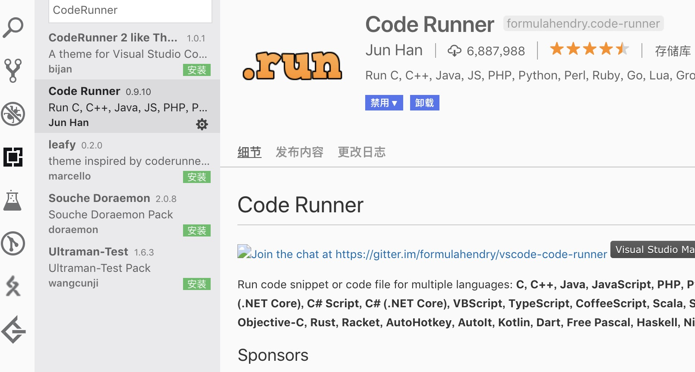

## Visual Studio Code - 微软家的编辑器

### 简介

Visual Studio Code（以下简称 VS Code) 是一个免费、开源、跨平台的由微软开发的程序编辑器。它是用 Typescript 编写的，并且采用 Electron 架构。官网是<https://code.visualstudio.com/>。它带有对 JavaScript、TypeScript 和 Node.js 的内置支持，并为其他语言（如 C++、Cype、Java、Python、PHP、GO）提供了丰富的扩展生态系统。

### 编译与运行

#### 使用CodeRunner插件

VSCode自身带有非常强大的C/C++功能，但配置过程比较复杂。一个简单的编译与运行C++程序的方案是安装CodeRunner插件。

CodeRunner是一个可以一键运行代码的插件，在工程上一般用来验证代码片段，支持Node.js, Python, C, C++, Java, PHP, Perl, Ruby, Go等超过40种语言。

打开插件商店，搜索CodeRunner并安装。或者去[Marketplace](https://marketplace.visualstudio.com/items?itemName=formulahendry.code-runner)



安装完成后，打开需要运行的文件，点击右上角的小三角图标（用过Code::Blocks或Visual Studio的童鞋肯定会有种熟悉的感觉），即可运行代码。或，按下快捷键`Ctrl+Alt+N`（在macOS下是`Control + Option + N`）也可以得到同样的效果。

???+ warning
    如果你安装了VSCode与此插件后仍然无法运行代码，很有可能是因为你没有安装相应语言的运行环境。

    例如在Windows上运行C/C++程序需要先安装MinGW或MinGW-w64环境。如果你使用的是Linux，系统应该已经带有C/C++运行环境，macOS运行 xcode-select --install 进行安装
    
运行示例：
```
$ cd "/Users/mike/Documents/luogu/" && g++ hello.cpp -o hello && "/Users/mike/Documents/luogu/"hello
Hello World!
```
