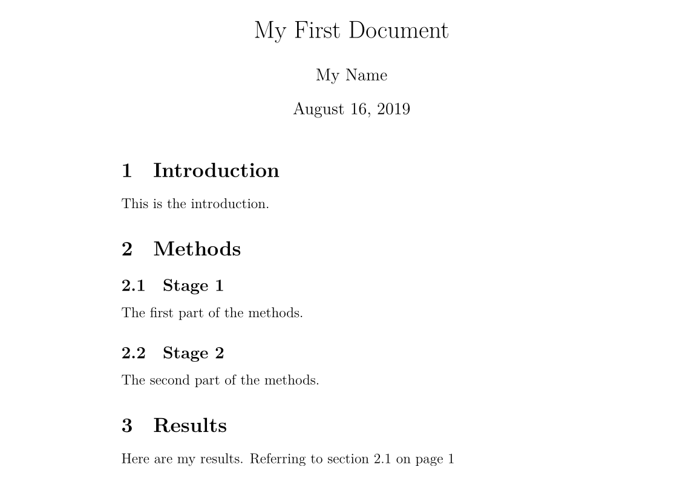
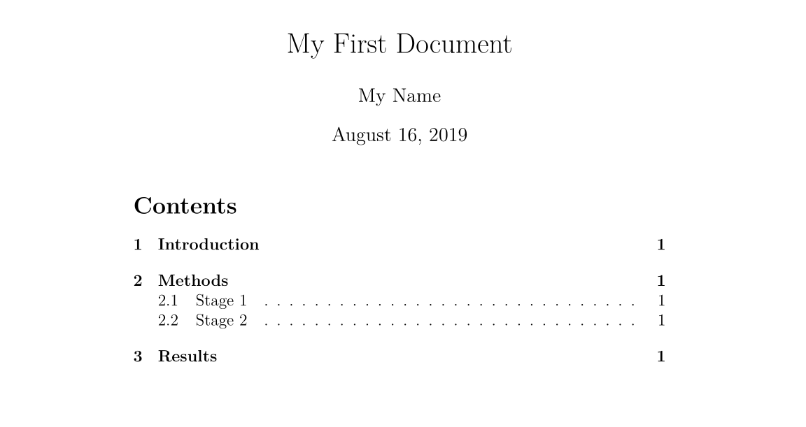
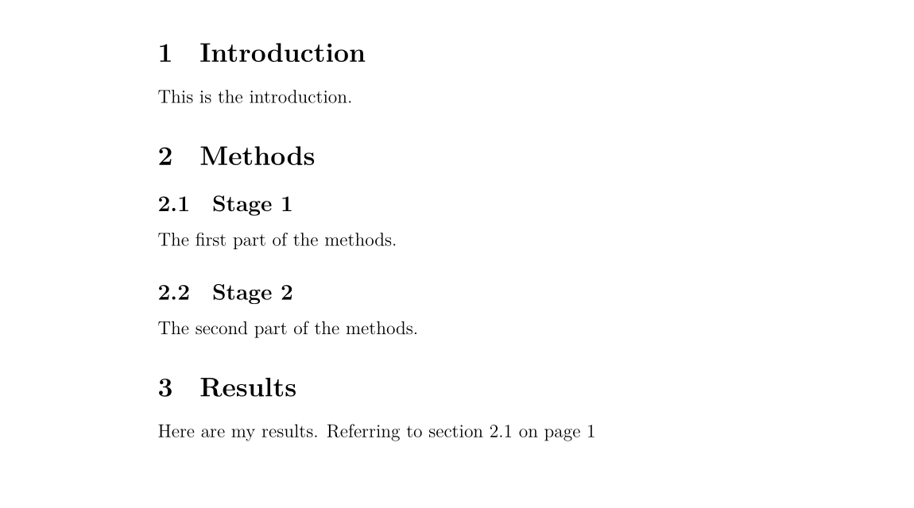
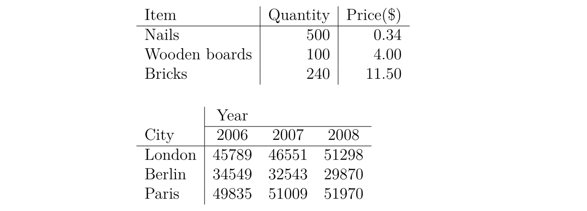

## 介绍

### 什么是 LaTeX

LaTeX（音_lay-tek_）是一个让你的文档看起来更专业的排版系统，而不是文字处理器。它尤其适合处理篇幅较长、结构严谨的文档，并且十分擅长处理公式表达。它是免费的软件，对大多数操作系统都适用。

LaTeX 基于 TeX（Donald Knuth 在 1978 年为数字化排版设计的排版系统）。TeX 是一种电脑能够处理的低级语言，但大多数人发现它很难使用。LaTeX 正是为了让它变得更加易用而设计的。目前 LaTeX 的版本是 LaTeX 2e。

如果你习惯于使用微软的 Office Word 处理文档，那么你会觉得 LaTeX 的工作方式让你很不习惯。Word 是典型的“所见即所得”的编辑器，你可以在编排文档的时侯查看到最终的排版效果。但使用 LaTeX 时你并不能方便地查看最终效果，这使得你专注于内容而不是外观的调整。

一个 LaTeX 文档是一个以 `.tex` 结尾的文本文件，可以使用任意的文本编辑器编辑，比如 Notepad，但对于大多数人而言，使用一个合适的 LaTeX 编辑器会使得编辑的过程容易很多。在编辑的过程中你可以标记文档的结构。完成后你可以进行编译——这意味着将它转化为另一种格式的文档。它支持多种格式，但最常用的是 PDF 文档格式。

### 在开始之前

下面列出在本文中使用到的记号：

-   希望你实施的操作会被打上一个箭头 $\rightarrow$ ；
-   你输入的字符会被装进代码块中；
-   菜单命令与按扭的名称会被标记为 **粗体** 。

尽管本书中的代码应该可以在任何的 LaTeX 编辑器中运行，在一些指定的示例和截图中，我们使用的环境是 TeXworks 0.4.5, Windows 7。

### Linux 环境配置

在此简单说明一下 Linux 环境下的 LaTeX 编译配置。首先，根据需要选择 TeX Live 包进行安装。该软件包含了 `pdflatex` ， `xelatex` 等命令。下文中的编译相当于使用这些命令编译。

## 文档结构

### 基本要素

 $\rightarrow$ 打开 TeXworks。

一个新的文档会被自动打开。

 $\rightarrow$ 进入 **Fomart** 菜单，选择 **Line Numbers** 。

行号并不是要素，但它可以帮助你比较代码与屏幕信息，找到错误。

 $\rightarrow$ 进入 **Format** 菜单，选择 **Syntax Coloring** ，然后选择 **LaTeX** 。

语法色彩会高亮代码，使得代码更加易读。

 $\rightarrow$ 输入以下文字：

```tex
\documentclass[a4paper,12pt]{article}

\begin{document}

A sentence of text.

\end{document}
```

 `\documentclass` 命令必须出现在每个 LaTeX 文档的开头。花括号内的文本指定了文档的类型。 **article** 文档类型适合较短的文章，比如期刊文章和短篇报告。其他文档类型包括 **report** （适用于更长的多章节的文档，比如博士生论文）， **proc** （会议论文集）， **book** 和 **slides** 。方括号内的文本指定了一些选项——示例中它设置纸张大小为 A4，主要文字大小为 12pt。

 `\begin{document}` 和 `\end{document}` 命令将你的文本内容包裹起来。任何在 `\begin{documnet}` 之前的文本都被视为前导命令，会影响整个文档。任何在 `\end{document}` 之后的文本都会被忽视。

空行不是必要的，但它可以让长的文档更易读。

 $\rightarrow$ 按下 **Save** 按扭； $\rightarrow$ 在 **Libraries>Documents** 中新建一个名为 **LaTeX course** 文件夹； $\rightarrow$ 将你的文档命名为 **Doc1** 并将其保存为 **TeX document** 放在这个文件夹中。

将不同的 LaTeX 文档放在不同的目录下，在编译的时侯组合多个文件是一个很好的想法。

 $\rightarrow$ 确保 typeset 菜单设置为了 **pdfLaTeX** 。 $\rightarrow$ 点击 **Typeset** 按扭。

这时你的源文件会被转换为 PDF 文档，这需要花费一定的时间。在编译结束后，TeXworks 的 PDF 查看器会打开并预览生成的文件。PDF 文件会被自动地保存在与 TeX 文档相同的目录下。

### 处理问题

如果在你的文档中存在错误，TeXworks 无法创建 PDF 文档时， **Typeset** 按扭会变成一个红叉，并且底部的终端输出会保持展开。这时：

 $\rightarrow$ 点击 **Abort typesetting** 按扭。 $\rightarrow$ 阅读终端输出的内容，最后一行可能会给出行号表示出现错误的位置。 $\rightarrow$ 找到文档中对应的行并修复错误。 $\rightarrow$ 再次点击 **Typeset** 按扭尝试编译源文件。

### 添加文档标题

 `\maketitle` 命令可以给文档创建标题。你需要指定文档的标题。如果没有指定日期，就会使用现在的时间，作者是可选的。

 $\rightarrow$ 在 `\begin{document}` 和 命令后紧跟着输入以下文本：

```tex
\title{My First Document}
\author{My Name}
\date{\today}
\maketitle
```

你的文档现在长成了这样：

```tex
\documentclass[a4paper,12pt]{article}

\begin{document}

\title{My First Document}
\author{My Name}
\date{\rightarrowday}
\maketitle

A sentence of text.

\end{document}
```

 $\rightarrow$ 点击 **Typeset** 按扭，核对生成的 PDF 文档。

要点笔记：

-    `\rightarrowday` 是插入当前时间的命令。你也可以输入一个不同的时间，比如 `\data{November 2013}` 。
-    **Article** 文档的正文会紧跟着标题之后在同一页上排版。 **Reports** 会将标题置为单独的一页。

### 章节

如果需要的话，你可能想将你的文档分为章（Chatpers）、节（Sections）和小节（Subsections）。下列分节命令适用于 **article** 类型的文档：

-    `\section{...}` 
-    `\subsection{...}` 
-    `\subsubsection{...}` 
-    `\paragraph{...}` 
-    `\subparagraph{...}` 

花括号内的文本表示章节的标题。对于 **report** 和 **book** 类型的文档我们还支持 `\chapter{...}` 的命令。

 $\rightarrow$ 将 "A sentence of text." 替换为以下文本：

```tex
\section{Introduction}
This is the introduction.

\section{Methods}

\subsection{Stage 1}
The first part of the methods.

\subsection{Stage 2}
The second part of the methods.

\section{Results}
Here are my results.
```

你的文档会变成

```tex
\documentclass[a4paper,12pt]{article}

\begin{document}

\title{My First Document}
\author{My Name}
\date{\today}
\maketitle

\section{Introduction}
This is the introduction.

\section{Methods}

\subsection{Stage 1}
The first part of the methods.

\subsection{Stage 2}
The second part of the methods.

\section{Results}
Here are my results.

\end{document}
```

 $\rightarrow$ 点击 **Typeset** 按扭，核对 PDF 文档。应该是长这样的：


### 创建标签

你可以对任意章节命令创建标签，这样他们可以在文档的其他部分被引用。使用 `\label{labelname}` 对章节创建标签。然后输入 `\ref{labelname}` 或者 `\pageref{labelname}` 来引用对应的章节。

 $\rightarrow$ 在 `\subsection{Stage 1}` 下面另起一行，输入 `\label{sec1}` 。 $\rightarrow$ 在 **Results** 章节输入 `Referring to section \ref{sec1} on page \pageref{sec1}` 。

你的文档会变成这样：

```tex
\documentclass[a4paper,12pt]{article}

\begin{document}

\title{My First Document}
\author{My Name}
\date{\rightarrowday}
\maketitle

\section{Introduction}
This is the introduction.

\section{Methods}

\subsection{Stage 1}
\label{sec1}
The first part of the methods.

\subsection{Stage 2}
The second part of the methods.

\section{Results}
Here are my results. Referring to section \ref{sec1} on page \pageref{sec1}

\end{document}
```

 $\rightarrow$ 编译并检查 PDF 文档（你可能需要连续编译两次）：



### 生成目录（TOC）

如果你使用分节命令，那么可以容易地生成一个目录。使用 `\tableofcontents` 在文档中创建目录。通常我们会在标题的后面建立目录。

你可能也想也想更改页码为罗马数字（i,ii,iii）。这会确保文档的正文从第 1 页开始。页码可以使用 `\pagenumbering{...}` 在阿拉伯数字和罗马数字见切换。

 $\rightarrow$ 在 `\maketitle` 之后输入以下内容：

```tex
\pagenumbering{roman}
\tableofcontents
\newpage
\pagenumbering{arabic}
```

 `\newpage` 命令会另起一个页面，这样我们就可以看到 `\pagenumbering` 命令带来的影响了。你的文档的前 14 行长这样：

```tex
\documentclass[a4paper,12pt]{article}

\begin{document}

\title{My First Document}
\author{My Name}
\date{\rightarrowday}
\maketitle

\pagenumbering{roman}
\tableofcontents
\newpage
\pagenumbering{arabic}
```

 $\rightarrow$ 编译并核对文档（可能需要多次编译，下文不赘述）。

文档的第一页长这样：



第二页：



## 文字处理

### 中文字体支持

阅读本文学习 LaTeX 的人，首要学会的自然是 LaTeX 的中文字体支持。事实上，让 LaTeX 支持中文字体有许多方法。在此我们仅给出最**简洁**的解决方案：使用 CTeX 宏包。只需要在文档的前导命令部分添加：

```tex
\usepackage[UTF8]{ctex}
```

就可以了。在编译文档的时侯使用 `xelatex` 命令，因为它是支持中文字体的。

### 字体效果

LaTeX 有多种不同的字体效果，在此列举一部分：

```tex
\textit{words in italics}
\textsl{words slanted}
\textsc{words in smallcaps}
\textbf{words in bold}
\texttt{words in teletype}
\textsf{sans serif words}
\textrm{roman words}
\underline{underlined words}
```

效果如下：


 $\rightarrow$ 在你的文档中添加更多的文本并尝试各种字体效果。

### 彩色字体

为了让你的文档支持彩色字体，你需要使用包（package）。你可以引用很多包来增强 LaTeX 的排版效果。包引用的命令放置在文档的前导命令的位置（即放在 `\begin{document}` 命令之前）。使用 `\usepackage[options]{package}` 来引用包。其中 **package** 是包的名称，而 **options** 是指定包的特征的一些参数。

使用 `\usepackage{color}` 后，我们可以调用常见的颜色：


使用彩色字体的代码为

```tex
{\color{colorname}text}
```

其中 **colorname** 是你想要的颜色的名字， **text** 是你的彩色文本内容。注意到示例效果中的黄色与白色是有文字背景色的，这个我们同样可以使用 Color 包中的 `\colorbox` 命令来达到。用法如下：

```tex
\colorbox{colorname}{text}
```

 $\rightarrow$ 在 `\begin{document}` 前输入 `\usepackage{color}` 。 $\rightarrow$ 在文档内容中输入 `{\color{red}fire}` 。 $\rightarrow$ 编译并核对 PDF 文档内容。

单词 fire 应该是红色的。

你也可以添加一些参数来调用更多的颜色，甚至自定义你需要的颜色。但这部分超出了本书的内容。如果想要获取更多关于彩色文本的内容请阅读 LaTeX Wikibook 的 [Colors 章节](http://en.wikibooks.org/wiki/LaTeX/Colors) 。

### 字体大小

接下来我们列举一些 LaTeX 的字体大小设定命令：

```tex
normal size words
{\tiny tiny words}
{\scriptsize scriptsize words}
{\footnotesize footnotesize words}
{\small small words}
{\large large words}
{\Large Large words}
{\LARGE LARGE words}
{\huge huge words}
```

效果如下：


 $\rightarrow$ 尝试为你的文本调整字体大小。

### 段落缩进

LaTeX 默认每个章节第一段首行顶格，之后的段落首行缩进。如果想要段落顶格，在要顶格的段落前加 `\noindent` 命令即可。如果希望全局所有段落都顶格，在文档的某一位置使用 `\setlength{\parindent}{0pt}` 命令，之后的所有段落都会顶格。

### 列表

LaTeX 支持两种类型的列表：有序列表（enumerate）和无序列表（itemize）。列表中的元素定义为 `\item` 。列表可以有子列表。

 $\rightarrow$ 输入下面的内容来生成一个有序列表套无序列表：

```tex
\begin{enumerate}
\item First thing
\item Second thing
\begin{itemize}
\item A sub-thing
\item Another sub-thing
\end{itemize}
\item Third thing
\end{enumerate}
```

 $\rightarrow$ 编译并核对 PDF 文档。

列表长这样：


可以使用方括号参数来修改无序列表头的标志。例如， `\item[-]` 会使用一个杠作为标志，你甚至可以使用一个单词，比如 `\item[One]` 。

下面的代码：

```tex
\begin{itemize}
\item[-] First thing
\item[+] Second thing
\begin{itemize}
\item[Fish] A sub-thing
\item[Plants] Another sub-thing
\end{itemize}
\item[Q] Third thing
\end{itemize}
```

生成的效果为


### 注释和空格

我们使用 % 创建一个单行注释，在这个字符之后的该行上的内容都会被忽略，直到下一行开始。

下面的代码：

```tex
It is a truth universally acknowledged% Note comic irony
in the very first sentence
, that a single man in possession of a good fortune, must
be in want of a wife.
```

生成的结果为


多个连续空格在 LaTeX 中被视为一个空格。多个连续空行被视为一个空行。空行的主要功能是开始一个新的段落。通常来说，LaTeX 忽略空行和其他空白字符，两个反斜杠（ `\\` ）可以被用来换行。

 $\rightarrow$ 尝试在你的文档中添加注释和空行。

如果你想要在你的文档中添加空格，你可以使用 `\vaspace{...}` 的命令。这样可以添加竖着的空格，高度可以指定。如 `\vspace{12pt}` 会产生一个空格，高度等于 12pt 的文字的高度。

### 特殊字符

下列字符在 LaTeX 中属于特殊字符：

```text
# $ % ^ & _ { } ~ \
```

为了使用这些字符，我们需要在他们前面添加反斜杠进行转义：

```tex
\# \$ \% \^{} \& \_ \{ \} \~{}
```

注意在使用 `^` 和 `~` 字符的时侯需要在后面紧跟一对闭合的花括号，否则他们就会被解释为字母的上标，就像 `\^ e` 会变成 $\^e$ 。上面的代码生成的效果如下：


注意，反斜杠不能通过反斜杠转义（不然就变成了换行了），使用 `\textbackslash` 命令代替。

 $\rightarrow$ 输入代码来在你的文档中生成下面内容：


询问专家或者查看本书的 TeX 源代码获取帮助。

## 表格

表格（tabular）命令用于排版表格。LaTeX 默认表格是没有横向和竖向的分割线的——如果你需要，你得手动设定。LaTeX 会根据内容自动设置表格的宽度。下面的代码可以创一个表格：

```tex
\begin{tabular}{...}
```

省略号会由定义表格的列的代码替换：

-    `l` 表示一个左对齐的列；
-    `r` 表示一个右对齐的列；
-    `c` 表示一个向中对齐的列；
-    `|` 表示一个列的竖线；

例如， `{lll}` 会生成一个三列的表格，并且保存向左对齐，没有显式的竖线； `{|l|l|r|}` 会生成一个三列表格，前两列左对齐，最后一列右对齐，并且相邻两列之间有显式的竖线。

表格的数据在 `\begin{tabular}` 后输入：

-    `&` 用于分割列；
-    `\\` 用于换行；
-    `\hline` 表示插入一个贯穿所有列的横着的分割线；
-    `\cline{1-2}` 会在第一列和第二列插入一个横着的分割线。

最后使用 `\end{tabular}` 结束表格。举一些例子：

```tex
\begin{tabular}{|l|l|}
Apples & Green \\
Strawberries & Red \\
Orange & Orange\\
\end{tabular}

\begin{tabular}{rc}
Apples & Green\\
\hline 
Strawberries & Red \\
\cline{1-1}
Oranges & Orange \\
\end{tabular}

\begin{tabular}{|r|l|}
\hline
8 & here's \\
\cline{2-2}
86 & stuff\\
\hline \hline 
2008 & now \\
\hline 
\end{tabular}
```

效果如下：


### 实践

尝试画出下列表格：



## 图表

本章介绍如何在 LaTeX 文档中插入图表。这里我们需要引入 **graphicx** 包。图片应当是 PDF，PNG，JPEG 或者 GIF 文件。下面的代码会插入一个名为 myimage 的图片：

```tex
\begin{figure}[h]
\centering
\includegraphics[width=1\textwidth]{myimage}
\caption{Here is my image}
\label{image-myimage}
\end{figure}
```

 `[h]` 是位置参数， **h** 表示把图表近似地放置在这里（如果能放得下）。有其他的选项： **t** 表示放在在页面顶端； **b** 表示放在在页面的底端； **p** 表示另起一页放置图表。你也可以添加一个 **!** 参数来强制放在参数指定的位置（尽管这样排版的效果可能不太好）。

 `\centering` 将图片放置在页面的中央。如果没有该命令会默认左对齐。使用它的效果是很好的，因为图表的标题也是居中对齐的。

 `\includegraphics{...}` 命令可以自动将图放置到你的文档中，图片文件应当与 TeX 文件放在同一目录下。

 `[width=1\textwidth]` 是一个可选的参数，它指定图片的宽度——与文本的宽度相同。宽度也可以以厘米为单位。你也可以使用 `[scale=0.5]` 将图片按比例缩小（示例相当于缩小一半）。

 `\caption{...}` 定义了图表的标题。如果使用了它，LaTeX 会给你的图表添加“Figure”开头的序号。你可以使用 `\listoffigures` 来生成一个图表的目录。

 `\label{...}` 创建了一个可以供你引用的标签。

### 实践

 $\rightarrow$ 在你文档的前导命令中添加 `\usepackage{graphicx}` 。 $\rightarrow$ 找到一张图片，放置在你的 **LaTeX course** 文件夹下。 $\rightarrow$ 在你想要添加图片的地方输入以下内容：

```tex
\begin{figure}[h!]
\centering
\includegraphics[width=1\textwidth]{ImageFilename}
\caption{My test image}
\end{figure}
```

将 **ImageFilename** 替换为你的文件的名字（不包括后缀）。如果你的文件名有空格，就使用双引号包裹，比如 `"screen 20"` 。

 $\rightarrow$ 编译并核对文件。

## 公式

使用 LaTeX 的主要原因之一是它可以方便地排版公式。我们使用数学模式来排版公式。

### 插入公式

你可以使用一对 `$` 来启用数学模式，这可以用于撰写行内数学公式。例如 `$1+2=3$` 的生成效果是 $1+2=3$ 。

如果你想要行间的公式，可以使用 `$$...$$` （现在我们推荐使用 `\[...\]` ，因为前者可能产生不良间距）。例如， `$$1+2=3$$` 的生产效果为

$$
1+2=3
$$

如果是生成带标号的公式，可以使用 `\begin{equation}...\end{equation}` 。例如 `\begin{equation}1+2=3\end{equation}` 生成的效果为：

$$
\begin{equation}1+2=3\end{equation}
$$

数字 6 代表的是章节的编号，仅当你的文档有设置章节时才会出现，比如 **report** 类型的文档。

使用 `\begin{eqnarray}...\end{eqnarray}` 来撰写一组带标号的公式。例如：

```tex
\begin{eqnarray}
a & = & b + c \\
  & = & y - z
\end{eqnarray}
```

生成的效果为

$$
\begin{eqnarray}
a & = & b + c \\
  & = & y - z
\end{eqnarray}
$$

要撰写不标号的公式就在环境标志的后面添加 `*` 字符，如 `{equation*}` ， `{eqnarray*}` 。

### 数学符号

尽管一些基础的符号可以直接键入，但大多数特殊符号需要使用命令来显示。

本书只是数学符号使用的入门教程，LaTeX Wikibook 的数学符号章节是另一个更好更完整的教程。如果想要了解更多关于数学符号的内容请移步。如果你想找到一个特定的符号，可以使用 [Detexfiy](http://detexify.kirelabs.org) ，它可以识别手写字符。

#### 上标和下标

上标（Powers）使用 `^` 来表示，比如 `$n^2$` 生成的效果为 $n^2$ 。

下标（Indices）使用 `_` 表示，比如 `$2_a$` 生成的效果为 $2_a$ 。

如果上标或下标的内容包含多个字符，请使用花括号包裹起来。比如 `$b_{a-2}$` 的效果为 $b_{a-2}$ 。

#### 分数

分数使用 `\frac{numerator}{denominator}` 命令插入。比如 `$$\frac{a}{3}$$` 的生成效果为

$$
\frac{a}{3}
$$

分数可以嵌套。比如 `$$\frac{y}{\frac{3}{x}+b}$$` 的生成效果为

$$
\frac{y}{\frac{3}{x}+b}
$$

#### 根号

我们使用 `\sqrt{...}` 命令插入根号。省略号的内容由被开根的内容替代。如果需要添加开根的次数，使用方括号括起来即可。

例如 `$$\sqrt{y^2}$$` 的生成效果为

$$
\sqrt{y^2}
$$

而 `$$\sqrt[x]{y^2}$$` 的生成效果为

$$
\sqrt[x]{y^2}
$$

#### 求和与积分

使用 `\sum` 和 `\int` 来插入求和式与积分式。对于两种符号，上限使用 `^` 来表示，而下限使用 `_` 表示。

 `$$\sum_{x=1}^5 y^z$$` 的生成效果为

$$
\sum_{x=1}^5y^z
$$

而 `$$\int_a^b f(x)$$` 的生成效果为

$$
\int_a^b f(x)
$$

#### 希腊字母

我们可以使用反斜杠加希腊字母的名称来表示一个希腊字母。名称的首字母的大小写决定希腊字母的形态。例如

-    `$\alpha$` = $\alpha$ 
-    `$\beta$` = $\beta$ 
-    `$\delta, \Delta$` = $\delta, \Delta$ 
-    `$\pi, \Pi$` = $\pi, \Pi$ 
-    `$\sigma, \Sigma$` = $\sigma, \Sigma$ 
-    `$\phi, \Phi, \varphi$` = $\phi, \Phi, \varphi$ 
-    `$\psi, \Psi$` = $\psi, \Psi$ 
-    `$\omega, \Omega$` = $\omega, \Omega$ 

### 实践

 $\rightarrow$ 撰写代码来生成下列公式：


如果需要帮助，可以查看本书的 TeX 源码。

## 参考文献

### 介绍

LaTeX 可以轻松插入参考文献以及目录。本文会介绍如何使用另一个 BibTeX 文件来存储参考文献。

### BibTeX 文件类型

BibTeX 文件包含了所有你想要在你文档中引用的文献。它的文件后缀名为 `.bib` 。它的名字应设置为你的 TeX 文档的名字。 `.bib` 文件是文本文件。你需要将你的参考文献按照下列格式输入：

```text
@article{
    Birdetal2001,
    Author = {Bird, R. B. and Smith, E. A. and Bird, D. W.},
    Title = {The hunting handicap: costly signaling in human foraging strategies},
    Journal = {Behavioral Ecology and Sociobiology},
    Volume = {50},
    Pages = {9-19},
    Year = {2001} 
}
```

每一个参考文献先声名它的文献类型（reference type）。示例中使用的是 @article，其他的类型包括 @book，@incollection 用于引用一本书的中的章节，@inproceedings 用于引用会议论文。可以 [在此](http://en.wikibooks.org/wiki/LaTeX/Bibliography_Management) 查看更多支持的类型。

接下来的花括号内首先要列出一个引用键值（citation key）。必须保证你引用的文献的引用键值是不同的。你可以自定义键值串，不过使用第一作者名字加上年分会是一个表义清晰的选择。

接下来的若干行包括文献的若干信息，格式如下：

```text
Field name = {field contents},
```

你可以使用 LaTeX 命令来生成特殊的文字效果。比如意大利斜体可以使用 `\emph{Rattus norvegicus}` 。

对于需要大写的字母，请用花括号包裹起来。BibTeX 会自动把标题中除第一个字母外所有大写字母替换为小写。比如 `Dispersal in the contemporary United States` 的生成效果为 $\text{Dispersal in the contemporary united states}$ ，而 `Dispersal in the contemporary {U}nited {S}tates` 的生成效果为 $\text{Dispersal in the contemporary United States}$ 。

你可以手写 BibTeX 文件，也可以使用软件来生成。

### 插入文献列表

使用下列命令在文档当前位置插入文献列表：

```tex
\bibliographystyle{plain}
\biblirgraphy{references}
```

参考文献写在 `references.bib` 里。

### 参考文献标注

使用 `\cite{citationkey}` 来在你想要引用文献的地方插入一个标注。如果你不希望在正文中插入一个引用标注，但仍想要在文献列表中显示这次引用，使用 `\nocite{citationkey}` 命令。

想要在引用中插入页码信息，使用方括号： `\cite[p. 215]{citationkay}` 。

要引用多个文献，使用逗号分隔： `\cite{citation01,citation02,citation03}` 。

### 引用格式

#### 数字标号引用

LaTeX 包含了多种行内数字标号引用的格式：

 **Plain** 方括号包裹数字的形式，如 $[1]$ 。文献列表按照第一作者的字母表顺序排列。每一个作者的名字是全称。

 **Abbrv** 与 **plain** 是相同的，但作者的名字是缩写。

 **Unsrt** 与 **plain** 是相同的，但文献列表的排序按照在文中引用的先后顺序排列。

 **Alpha** 与 **plain** 一样，但引用的标注是作者的名字与年份组合在一起，不是数字，如 $[Kop10]$ 。

#### 作者日期引用

如果你想使用作者日期的引用，使用 **natbib** 包。它使用 `\citep{...}` 命令来生成一个方括号标注，如 $[Koppe,2010]$ ，使用 `\citet{...}` 来生成一个标注，只把年份放到方括号里，如 $Koppe [2010]$ 。 [在此](http://mirror.ctan.org/macros/latex/contrib/natbib/natnotes.pdf) 查看它的更多用法。

Natbib 包也有三种格式： **plainnat** ， **abbrvnat** 和 **unsrtnat** ，他们与 **plain** ， **abbrv** 和 **unsrt** 的效果是一样的。

#### 其他引用格式

如果你需要使用不同的格式，你需要在同一个文件夹下创建一个格式文件（ `.bst` 文件），引用这个格式的时侯使用它的文件名调用 `\bibliographystyle{...}` 命令实现。

### 实践

 $\rightarrow$ 在同一文件夹下新建一个同名的 BibTeX 文件，用正确的格式输入参考文献的信息。 $\rightarrow$ 切换到 TeX 文档，并使用 `\cite` ， `\bibliographystyle` 和 `\bibliograph` 命令来引用文献。 $\rightarrow$ 编译 TeX 文件。 $\rightarrow$ 切换到 BibTeX 文件，并编译（点击 **Typeset** 按扭） $\rightarrow$ 切换到 TeX 文件并编译它 **两次** ，然后核对 PDF 文档。

## 更多阅读

LaTeX Project <http://www.latex-project.org/> Official website - has links to documentation, information about installing LATEX on your own computer, and information about where to look for help.

The Not So Short Introduction to LaTeX2e <http://ctan.tug.org/tex-archive/info/lshort/english/lshort.pdf> A good tutorial for beginners.

LaTeX Wikibook <http://en.wikibooks.org/wiki/LaTeX/> Comprehensive and clearly written, although still a work in progress. A downloadable PDF is also available.

Comparison of TeX Editors on Wikipedia <http://en.wikipedia.org/wiki/Comparison_of_TeX_editors> Information to help you to choose which L A TEX editor to install on your own computer.

TeX Live <http://www.tug.org/texlive/> “An easy way to get up and running with the TeX document production system”。Available for Unix and Windows (links to MacTeX for MacOSX users). Includes the TeXworks editor.

Workbook Source Files <http://edin.ac/17EQPM1> Download the .tex file and other files needed to compile this workbook.

 **本文译自 <http://www.docs.is.ed.ac.uk/skills/documents/3722/3722-2014.pdf> ** 
