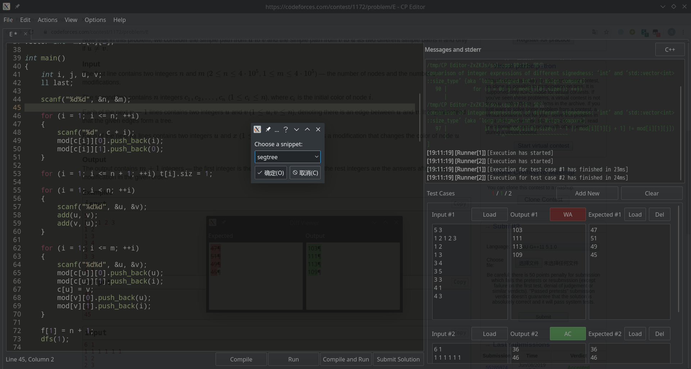

## 简介

CP Editor 是一款专门为算法竞赛（Competitive Programming）设计的 IDE，其核心特性有：

- 从各大 OJ（如：Codeforces，AtCoder，洛谷，LOJ）解析样例。可以是一道题目的也可以是一场比赛的，尤其适合于打 CF。
- 一键编译+测试所有测试点。这里的测试点可以是从 OJ 上解析得到的，也可以是手动输入的，还可以是从文件中读取的，还能和代码一起保存，下次打开时不需要重新输入。
- 如果没有通过某个测试点，可以通过 Diff Viewer 快速找到错误的地方。
- 可以在 IDE 内提交至 CF 并查看评测结果。
- 自定义代码模板，既可以定义新建文件时使用的模板（如各种 define 还有快读之类的），也可以定义一键插入的模板（如快速幂、树状数组、NTT 之类的）。
- 一键代码格式化，可以全文格式化也可以只格式化选中部分，支持自定义风格。
- 支持退出时保存窗口状态，下次打开时自动加载。
- 可以设置主窗口的透明度。
- 多种可选的编辑器主题（Light, Drakula, Monkai, Solarised, Solarised Dark）。
- 支持 Window，Linux 和 Mac OS。

功能展示图：

（注：该图是在 Manjaro KDE 的暗色微风主题下的截图，在其它系统/主题下可能有所不同。）

!!! warning
    本文基于 CP Editor 5.9.4，未来版本可能与此不同。

## 安装

下载地址：<https://github.com/coder3101/cp-editor/releases> 。

国内用户还可以在 [这里](https://pan.wzf2000.top/s/md70l8h0) 下载，应该会比 Github 上下载快一些，但不保证这个链接始终保持更新。

由于这个项目还处于开发初期，很多时候有了一些修改却没有发布。如果想体验最新的 feature，还可以自己从源码编译，这部分可以参考 [README](https://github.com/coder3101/cp-editor#build-from-source) 。

## 配置

### 安装 Competitive Companion

从 OJ 解析样例并不是 CP Editor 原生的 feature，而是依赖于一款名为 Competitive Companion 的浏览器插件。

项目主页：<https://github.com/jmerle/competitive-companion>。

### 安装 CF Tool

如果你想在 IDE 内提交代码到 CF 上，就需要安装 CF Tool。

下载地址：<https://github.com/xalanq/cf-tool/releases>。

### 安装 Clang Format

如果你想要使用代码格式化，就得安装 Clang Format。

下载地址：<https://releases.llvm.org/download.html> 或 <https://github.com/llvm/llvm-project/releases/tag/llvmorg-9.0.1> 。

### 设置 Preferences

可以在 Options→Preferences 中打开，也可以按快捷键 Ctrl+P 打开。

右下角的 OK 和 Cancel 不必多说，Apply 是应用更改而不关闭设置窗口，初次配置时非常有用。

#### Editor

- Code Editor theme: 代码编辑器主题。
- Tab Length: 缩进长度。
- Editor Transparency: 主窗口透明度。
- Font: 代码编辑器字体。
- Auto Indent: 自动缩进。
- Bracket Completion: 自动括号补全。
- Wrap Text: 自动换行。
- Replace tabs with spaces: 自动将输入的制表符替换为 Tab Length 个空格。
- Format source on save: 保存时自动格式化。
- Save and load test cases: 保存测试点到代码同目录下。
- Hot Exit: 关闭窗口时存储窗口状态，下次打开时加载。

#### Language

这里可以设置默认使用的语言、编译选项、运行时选项等。

C++ 的常用编译命令：`g++ -Wall -Wshadow -Wextra -O2`，如果是 Windows 还要加上 `-Wl,--stack=512000000` 开栈。

运行时选项一般用不上，效果是运行时加上命令行参数。

#### Formatting

- Clang Format Command: 如果 `clang-format` 在你系统的 PATH 里，填 `clang-format` 即可，否则可以填可执行程序的路径。
- Clang Format Style: 即 `.clang-format` 文件中应该填写的内容，可以参考 [Clang Format 文档](https://clang.llvm.org/docs/ClangFormat.html) 。

#### Competitive Companion

- Enable Competitive Companion Server: 如果你想从 OJ 解析样例就得开启这个。
- Open new tabs for Compeititve Companion: 若开启则解析样例时会新建标签页，否则会填入并覆盖当前标签页的测试点。如果要解析一场比赛则必须勾选这一项。
- Competitive Companion Port: 一般保持默认的 10045 即可（无需修改浏览器扩展的设置），否则要在浏览器扩展 Competitive Companion 中修改为同样的值。

#### Snippets

可以在这里添加用于插入的模板。

可以用代码编辑器输入，也可以通过 "Load Snippets From Files" 导入。

可以用 Ctrl+S, Ctrl+N, Ctrl+D, Ctrl+R 代替 Save, New, Delete, Rename 按钮。

#### Keybinding

一些操作的热键。这些操作往往都有默认的快捷键，如果有需要可以在这里设置额外的自定义热键。

#### Extras

- Check for updates on startup: 启动时检查更新。
- Notify for beta updates as well: 通知不稳定版本的更新。
- Templates: 新建标签页时使用的模板。
- Time Limit: 运行代码的时间限制，超时会 kill 掉，单位是毫秒。
- CF Tool Command: 如果在 PATH 里 `cf` 即可，否则填可执行文件的路径。

## 使用

基础功能不必多说，看菜单就能了解大部分功能以及快捷键。

需要提醒的有：

1. Open Contest 的功能是打开一个文件夹，在里面创建 `A.cpp`, `B.cpp`, `C.cpp`...
2. Edit 中有一些方便的编辑用快捷键。
3. Actions 中的 Detached Run 是在弹出的命令行窗口中运行，可以手动输入，适合交互题等。Linux 下需要安装 xterm。
4. 在 View 中可以调整三种视图模式，实际上如果用鼠标点击不如直接拖动编辑器和右侧窗口的交界处，正确使用姿势是在 Preferences 中为 Toggling View Mode 设置热键。
5. Diff Viewer 在 Output #X 右侧显示是否 AC 的按钮打开。

CP Editor 还支持一些命令行选项，具体可以在命令行中运行 `CPEditor --help` 查看。命令行选项在 cmd 上支持不太好，如果是 Windows 建议使用 git bash。

## 优点

1. 有很多为算法竞赛设计的 feature，写题并进行测试非常方便。
2. 安装、配置简单，体积小，运行时占用空间小。
3. 正如 OI Wiki 专为 OI 创办从而会逐渐变得比 Wikipedia 更适合 OI，专为算法竞赛设计的 CP Editor 也会逐渐变得比其它 IDE 更适合 OI。

## 缺点

1. 目前仍处于开发初期，功能不是很完善，也有少量的 bug。由于用户和维护者的人数都较少，所以开发进度较慢，功能的完善和程序的稳定都需要一定的时间。
2. 虽然有很多为算法竞赛而设计的 feature，但缺少一些代码编辑器的基本 feature，如自动补全、函数参数提示等。
3. 目前还未汉化，界面上只有英文。但由于配置简单，这并不会给国内用户带来太大的障碍。

## 如何变得更好？

### 使用它！

CP Editor 现在一个很大的问题是用户数量少，如果用户数量增加了，bug 就更容易被发现，稳定性就会增加。

同时，用户数量的增加也是开发者的动力，越来越多的开发者投入更多的时间，它就会变得越来越好。

如果你在使用时发现了 bug，或者有什么想要的 feature，可以在 Github 上 [提 issue](https://github.com/coder3101/cp-editor/issues)。

如果你觉得它不错，别忘了在 [Github](https://github.com/coder3101/cp-editor) 上给它一个 star，并且向周围人推荐。

### 参与贡献

正如 OI Wiki 一样，CP Editor 也是 Github 上的一个开源项目，人人都能参与其中。

参与的方式多种多样，你可以阅读 [README.md](https://github.com/coder3101/cp-editor/blob/master/README.md)，[CONTRIBUTING.md](https://github.com/coder3101/cp-editor/blob/master/CONTRIBUTING.md)，完善它们的内容，修改其中的 typo。

如果你对工程开发感兴趣，你可以参与到代码编写中。具体可以参考 [贡献指南](https://github.com/coder3101/cp-editor/blob/master/CONTRIBUTING.md)，其中，Qt 可以在 [清华镜像](https://mirrors.tuna.tsinghua.edu.cn/qt/official_releases/qt/5.14/5.14.1/) 下载，Windows 下推荐安装 [Visual Studio](https://visualstudio.microsoft.com/) 及其 CMake 组件。

如果你是初次参与开发，可以试着先去解决那些 [good first issues](https://github.com/coder3101/cp-editor/issues?q=is%3Aissue+is%3Aopen+label%3A%22good+first+issue%22) ，它们被认为是对新手友好的。

### 交流

欢迎加入 Telegram 群组参与交流：<https://t.me/cpeditor>

无法上 tg？不要紧，大多数的对话都是发生在 [Github](https://github.com/coder3101/cp-editor) 上的，你可以在那里报告 bug，请求 feature，参与贡献，就像在 OI Wiki 一样。
