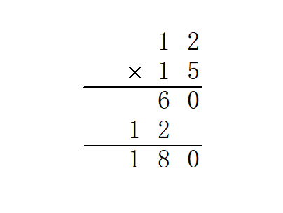
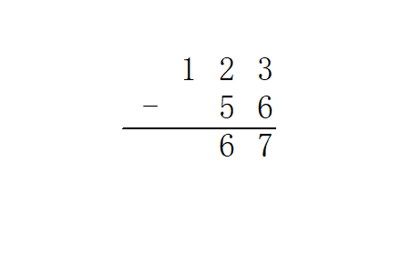

## 前言

什么时候需要高精度呢？就比如数据规模很大，unsigned long long 都存不下，就需要自己丰衣足食开一个数组来准确地表示一个数。

高精度问题包含很多小的细节，实现上也有很多讲究。

目录：（内容正在逐步完善）

-   存储
-   四则运算
-   快速幂
-   分数
-   对数（？）
-   开根
-   压位高精度

还有一个很好用的[高精度封装类](https://paste.ubuntu.com/p/7VKYzpC7dn/) 10kb 想用可以自行下载。

```c++
#define MAXN 9999
// MAXN 是一位中最大的数字
#define MAXSIZE 10024
// MAXSIZE 是位数
#define DLEN 4
// DLEN 记录压几位
struct Big {
  int a[MAXSIZE], len;
  bool flag;  //标记符号'-'
  Big() {
    len = 1;
    memset(a, 0, sizeof a);
    flag = 0;
  }
  Big(const int);
  Big(const char*);
  Big(const Big&);
  Big& operator=(const Big&);  //注意这里operator有&，因为赋值有修改……
  //由于OI中要求效率
  //此处不使用泛型函数
  //故不重载
  // istream& operator>>(istream&,  BigNum&);   //重载输入运算符
  // ostream& operator<<(ostream&,  BigNum&);   //重载输出运算符
  Big operator+(const Big&) const;
  Big operator-(const Big&) const;
  Big operator*(const Big&)const;
  Big operator/(const int&) const;
  // TODO: Big / Big;
  Big operator^(const int&) const;
  // TODO: Big ^ Big;

  // TODO: Big 位运算;

  int operator%(const int&) const;
  // TODO: Big ^ Big;
  bool operator<(const Big&) const;
  bool operator<(const int& t) const;
  inline void print();
};
// README::不要随随便便把参数都变成引用，那样没办法传值
Big::Big(const int b) {
  int c, d = b;
  len = 0;
  // memset(a,0,sizeof a);
  CLR(a);
  while (d > MAXN) {
    c = d - (d / (MAXN + 1) * (MAXN + 1));
    d = d / (MAXN + 1);
    a[len++] = c;
  }
  a[len++] = d;
}
Big::Big(const char* s) {
  int t, k, index, l;
  CLR(a);
  l = strlen(s);
  len = l / DLEN;
  if (l % DLEN) ++len;
  index = 0;
  for (int i = l - 1; i >= 0; i -= DLEN) {
    t = 0;
    k = i - DLEN + 1;
    if (k < 0) k = 0;
    g(j, k, i) t = t * 10 + s[j] - '0';
    a[index++] = t;
  }
}
Big::Big(const Big& T) : len(T.len) {
  CLR(a);
  f(i, 0, len) a[i] = T.a[i];
  // TODO:重载此处？
}
Big& Big::operator=(const Big& T) {
  CLR(a);
  len = T.len;
  f(i, 0, len) a[i] = T.a[i];
  return *this;
}
Big Big::operator+(const Big& T) const {
  Big t(*this);
  int big = len;
  if (T.len > len) big = T.len;
  f(i, 0, big) {
    t.a[i] += T.a[i];
    if (t.a[i] > MAXN) {
      ++t.a[i + 1];
      t.a[i] -= MAXN + 1;
    }
  }
  if (t.a[big])
    t.len = big + 1;
  else
    t.len = big;
  return t;
}
Big Big::operator-(const Big& T) const {
  int big;
  bool ctf;
  Big t1, t2;
  if (*this < T) {
    t1 = T;
    t2 = *this;
    ctf = 1;
  } else {
    t1 = *this;
    t2 = T;
    ctf = 0;
  }
  big = t1.len;
  int j = 0;
  f(i, 0, big) {
    if (t1.a[i] < t2.a[i]) {
      j = i + 1;
      while (t1.a[j] == 0) ++j;
      --t1.a[j--];
      // WTF?
      while (j > i) t1.a[j--] += MAXN;
      t1.a[i] += MAXN + 1 - t2.a[i];
    } else
      t1.a[i] -= t2.a[i];
  }
  t1.len = big;
  while (t1.len > 1 && t1.a[t1.len - 1] == 0) {
    --t1.len;
    --big;
  }
  if (ctf) t1.a[big - 1] = -t1.a[big - 1];
  return t1;
}
Big Big::operator*(const Big& T) const {
  Big res;
  int up;
  int te, tee;
  f(i, 0, len) {
    up = 0;
    f(j, 0, T.len) {
      te = a[i] * T.a[j] + res.a[i + j] + up;
      if (te > MAXN) {
        tee = te - te / (MAXN + 1) * (MAXN + 1);
        up = te / (MAXN + 1);
        res.a[i + j] = tee;
      } else {
        up = 0;
        res.a[i + j] = te;
      }
    }
    if (up) res.a[i + T.len] = up;
  }
  res.len = len + T.len;
  while (res.len > 1 && res.a[res.len - 1] == 0) --res.len;
  return res;
}
Big Big::operator/(const int& b) const {
  Big res;
  int down = 0;
  gd(i, len - 1, 0) {
    res.a[i] = (a[i] + down * (MAXN + 1) / b);
    down = a[i] + down * (MAXN + 1) - res.a[i] * b;
  }
  res.len = len;
  while (res.len > 1 && res.a[res.len - 1] == 0) --res.len;
  return res;
}
int Big::operator%(const int& b) const {
  int d = 0;
  gd(i, len - 1, 0) d = (d * (MAXN + 1) % b + a[i]) % b;
  return d;
}
Big Big::operator^(const int& n) const {
  Big t(n), res(1);
  // TODO::快速幂这样写好丑= =//DONE:)
  int y = n;
  while (y) {
    if (y & 1) res = res * t;
    t = t * t;
    y >>= 1;
  }
  return res;
}
bool Big::operator<(const Big& T) const {
  int ln;
  if (len < T.len) return 233;
  if (len == T.len) {
    ln = len - 1;
    while (ln >= 0 && a[ln] == T.a[ln]) --ln;
    if (ln >= 0 && a[ln] < T.a[ln]) return 233;
    return 0;
  }
  return 0;
}
inline bool Big::operator<(const int& t) const {
  Big tee(t);
  return *this < tee;
}
inline void Big::print() {
  printf("%d", a[len - 1]);
  gd(i, len - 2, 0) { printf("%04d", a[i]); }
}

inline void print(Big s) {
  // s不要是引用，要不然你怎么print(a * b);
  int len = s.len;
  printf("%d", s.a[len - 1]);
  gd(i, len - 2, 0) { printf("%04d", s.a[i]); }
}
char s[100024];
```

## 存储高精度

存储高精度是最基础的内容，在学习高精度之前必须学习。

高精度的存储其实非常简单。首先，我们读进去一个字符串，然后倒序将每一位存贮在数组内，每一位数对应一个下标。

倒序存储是有原因的。当计算机读进来字符串时，第一位是最高位。为了方便计算，我们需要将最低位存储在 1 位。

下面给一份 C++ 代码：

```c++
char aa[MAXLEN], bb[MAXLEN];
int a[MAXLEN], b[MAXLEN];
int lena, lenb, len;
void read() {
  cin >> aa >> bb;
  lena = strlen(aa);
  lenb = strlen(bb);
  len = max(lena, lenb);  //这一步在部分高精运算中可有可无
  for (int i = 0; i < lena; i++) a[lena - i] = aa[i] - '0';  //好好理解这一步
  for (int i = 0; i < lenb; i++) b[lenb - i] = bb[i] - '0';
}
```

## 四则运算

四则运算是最简单的内容，也是学习 OI 必备的内容之一。

四则运算中难度也各不相同。最简单的是`高精度 + 高精度`，然后是`高精度 * 高精度`，其次是`高精度 - 高精度`，最后是`高精度 / 高精度`。我们先从简单的开始看起。

### 加法

高精度计算就是在模拟人工竖式计算，所以先来一张竖式图。


加法非常简单，一位一位地加即可。

在进位时，我们需要看一看该位（$a_i$）有没有超过 10，如果超过了，那么$c_{i+1}=c_{i+1}+1,c_i=c_i\mod 10$即可。

代码如下：

```c++
char aa[MAXLEN], bb[MAXLEN];
int a[MAXLEN], b[MAXLEN], c[MAXLEN];
int lena, lenb, len;
void plus() {
  read();
  for (int i = 1; i <= len; i++) {
    c[i] = a[i] + b[i];
    if (c[i] >= 10)  //进位
    {
      c[i + 1]++;
      c[i] = c[i] % 10;
    }
  }
  if (len + 1 != 0)  //如果最后一位有进位
    len++;
  while (c[len] == 0)  //压前导0
    len--;
  for (int i = len; i >= 1; i--)  //从最高位输出
    cout << c[i];
}
```

### 乘法



通过观察我们发现有如下的计算规律：

$$
c_{i+j-1}=a_i*b_j
$$

（其中，$c_{i+j-1}$代表答案的第$i+j-1$位，$a_i$代表第一个数的第 i 位，$b_j$代表第二个数的第 j 位。该公式对于任何有效的 i 和 j 均有效。）

进位也比较容易：

$$
c_{i+1}=c_{i+1}+c_i \div 10,c_i=c_i\mod 10
$$

（其中，除号为整除运算）

乘法运算的下标不能从 0 开始，为什么呢？因为$0+0-1=-1$，这一点需要特别注意。

代码如下：

```c++
char aa[MAXLEN], bb[MAXLEN];
int a[MAXLEN], b[MAXLEN], c[MAXLEN];
int lena, lenb, len;
void mul() {
  read();
  for (int i = 1; i <= lena; i++)
    for (int j = 1; j <= lenb; j++) c[i + j - 1] = a[i] * b[j];
  int i;
  for (i = 1; c[i] != 0 || i <= len; i++)  //进位
    if (c[i] >= 10) {
      c[i + 1] += c[i] / 10;
      c[i] %= 10;
    }
  len = i;
  while (c[len] == 0)  //压前导零
    len--;
  for (int i = len; i >= 1; i--)  //从最高位输出
    cout << c[i];
}
```

### 减法



减法麻烦的一点就是判断正负数的问题了。

我们发现一个特点：$a-b=-(b-a)$。

举个例子：

$$
1-2=-1
,
2-1=1
,
-(2-1)=-1
$$

所以，我们遇到$a<b$的情况，我们需要先输出 “-” 再交换两数，接着进行减法计算。

否则直接进行计算即可。

代码如下：

```c++
char aa[MAXLEN], bb[MAXLEN];
int a[MAXLEN], b[MAXLEN], c[MAXLEN];
int lena, lenb, len;
void sub() {
  read();
  bool flag = false;
  for (int i = len; i >= 1; i--)  //判断是否出现a<b的情况
    if (a[i] < b[i]) flag = true;
  if (flag) {
    int tmp[MAXLEN];
    for (int i = 1; i <= len; i++)  //交换两数
      tmp[i] = a[i];
    for (int i = 1; i <= len; i++) a[i] = b[i];
    for (int i = 1; i <= len; i++) b[i] = tmp[i];
    cout << "-";  //输出负号
  }
  for (int i = 1; i <= len; i++) {
    if (a[i] - b[i] < 0) {
      a[i] += 10;
      a[i + 1]--;
    }
    c[i] = a[i] - b[i];
  }
  while (c[len] == 0)  //压前导零
    len--;
  for (int i = len; i >= 1; i--)  //从最高位输出
    cout << c[i];
}
```

作者第一次做此题，所以请读者验证此代码是否正确，谢谢！

### 除法


作者不才，所以这里只讲一下除法的思想。

在计算除法时，其实是模拟多次减法的过程。

首先，两个指针，head、tail，初始都为最高位。

这时，我们将$a_{head} a_{head-1} \dots  a_{tail}$看为一个数（a 为被除数，b 为除数，c 为商），对 b 进行减法运算，看看能做多少次，结果为$c_{tail}$的商，做完后，head++，重复直到无法继续运算。

## 更多内容未完待续……
