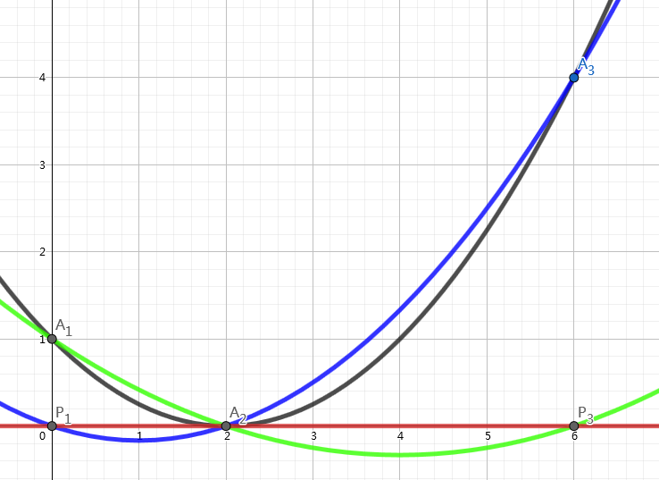

??? note " 例题[洛谷 P4781【模板】拉格朗日插值](https://www.luogu.org/problemnew/show/P4781)"

### 题目大意

给出 $n$ 个点 $P_i(x_i,\,y_i)$ ，将过这 $n$ 个点的最多 $n-1$ 次的多项式记为 $f(x)$ ，求 $f(k)$ 的值。

### 方法 1：差分法

差分法适用于 $x_i=i$ 的情况。

如，用差分法求 $f(x)=\sum_{i=1}^{x} i^2$ 的多项式形式。

    1   5   14   30   55   91
      4   9    16   25   36
        5   7     9   11
          2    2    2

第一行为 $f(x)$ 的连续的前几项；若上面一行有 $n$ 个值，下面一行有 $n-1$ 个值，每个值为上面对应的相邻两项的差。观察到，如果这样操作的次数足够多（前提是 $f(x)$ 为多项式），每次总会返回一个定值，可以利用这个定值求出 $f(x)$ 的每一项的系数，然后即可将 $k$ 代入多项式中求解。如上例中可求出 $f(x)=\frac 1 3 n^3+\frac 1 2 n^2+\frac 1 6 n$ 。时间复杂度为 $O(n^2)$ ，对给出的点的限制性较强。

### 方法 2：高斯消元

使用 **待定系数法** 。设 $f(x)=\sum_{i=0}^{n-1} a_ix^i$ 将每个 $x_i$ 代入 $f(x)$ ，有 $f(x_i)=y_i$ ，这样就可以得到一个由 $n$ 条 $n$ 元 $1$ 次方程所组成的方程组，然后使用 **高斯消元** 求出每一项 $a_i$ ，然后将 $k$ 代入求值。

如果您不知道什么是高斯消元，请看[luogu P3389 高斯消元法](https://www.luogu.org/problemnew/show/P3389)。

时间复杂度 $O(n^3)$ ，对给出点的坐标无要求。

### 方法 3：拉格朗日差值法

考虑将每个点做一个对于 $x$ 轴的垂线，设垂足为 $H_i(x_i,\,0)$ 。



如上图所示，黑线等于蓝线加绿线加红线。每次我们选择 $1$ 个 $P_i$ ，并选择其他的 $H_j[j\neq i]$ ，做一条过这些点的一条至多 $n-1$ 次的线。由于有 $n-2$ 个点都在 $x$ 轴上，我们知道这条线的解析式一定是形如 $g_i(x)=y_i\times (\prod_{i=1}^{n} (x-x_i)[i\neq x])$ 的形式。

最后将所有的 $g(x)$ 相加，即 $f(x)=\sum_{i=1}^{n}g_i(x)$ 。因为对于每个点 $P_i$ ，都只有一条函数经过 $P_i$ ，其余都经过 $H_i$ ，这一项的系数是 $0$ ，所以最后的和函数总是过所有 $n$ 个点的。

公式整理得：

 $f(x)=\sum_{i=1}^{n} y_i\times(\prod_{j\neq i }\frac{x-x_j}{x_i-x_j})$ 

如果要将每一项都算出来，时间复杂度仍是 $O(n^2)$ 的，但是本题中只用求出 $f(k)$ 的值，所以只需将 $k$ 代入进式子里得：

 $\mathrm{answer}=\sum_{i=1}^{n} y_i\times(\prod_{j\neq i }\frac{k-x_j}{x_i-x_j})$ 

本题中，还需要求解逆元。如果先分别计算出分子和分母，再将分子乘进分母的逆元，累加进最后的答案，时间复杂度的瓶颈就不会在求逆元上，时间复杂度为 $O(n^2)$ 。

### 代码实现

```cpp
#include <algorithm>
#include <cstdio>
#include <cstring>
using namespace std;
const int maxn = 2010;
typedef long long ll;
ll mod = 998244353;
ll n, k, x[maxn], y[maxn], ans, s1, s2;
ll powmod(ll a, ll x) {
  ll ret = 1ll, nww = a;
  while (x) {
    if (x & 1) ret = ret * nww % mod;
    nww = nww * nww % mod;
    x >>= 1;
  }
  return ret;
}
ll inv(ll x) { return powmod(x, mod - 2); }
int main() {
  scanf("%lld%lld", &n, &k);
  for (int i = 1; i <= n; i++) scanf("%lld%lld", x + i, y + i);
  for (int i = 1; i <= n; i++) {
    s1 = y[i] % mod;
    s2 = 1ll;
    for (int j = 1; j <= n; j++)
      if (i != j)
        s1 = s1 * (k - x[j]) % mod, s2 = s2 * ((x[i] - x[j] % mod) % mod) % mod;
    ans += s1 * inv(s2) % mod;
    ans = (ans + mod) % mod;
  }
  printf("%lld\n", ans);
  return 0;
}
```
