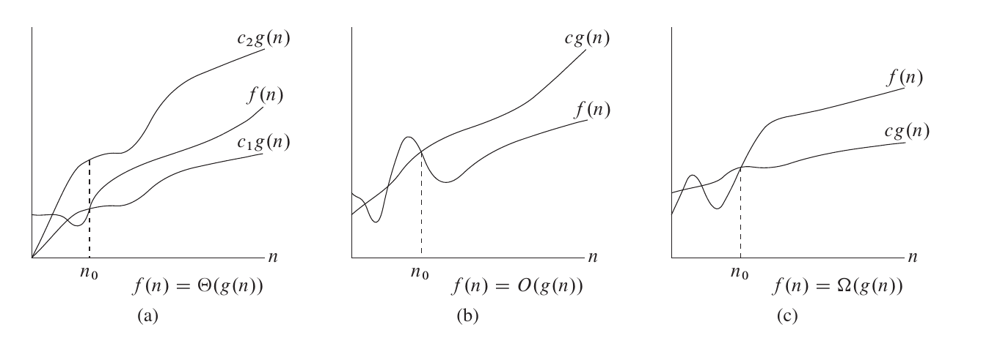

author: linehk

复杂度是我们衡量一个算法好坏的重要的标准。在算法竞赛中，我们通常关注于算法的时间复杂度和空间复杂度。

一般来说，复杂度是一个关于数据规模的函数。对于某些算法来说，相同数据规模的不同数据依然会造成算法的运行时间/空间的不同，因此我们通常使用算法的最坏时间复杂度，记为 $T(n)$ 。对于一些特殊的情况，我们可能会关心它的平均情况复杂度（特别是对于随机算法 (randomized algorithm)），这个时候我们通过使用随机分析 (probabilistic analysis) 来得到期望的复杂度。

## 渐进符号

我们通常使用渐进符号来描述一个算法的复杂度。

### 大 Θ 符号

对于给定的一个函数 $g(n)$ , $f(n)=\Theta(g(n))$ ，当且仅当 $\exists c_1,c_2,n_0>0$ ，使得 $\forall n \ge n_0, 0\le c_1\cdot g(n)\le f(n) \le c_2\cdot g(n)$ 。

也就是说，如果函数 $f(n)=\Theta(g(n))$ ，那么我们能找到两个正数 $c_1, c_2$ 使得 $f(n)$ 被 $c_1\cdot g(n)$ 和 $c_2\cdot g(n)$ 夹在中间。

### 大 O 符号

 $\Theta$ 符号同时给了我们一个函数的上下界，如果我们只有一个函数的渐进上界的时候，我们使用 $O$ 符号。对于一个给定的函数 $g(n)$ , 我们把它记作 $O(g(n))$ 。 $f(n)=O(g(n))$ ，当且仅当 $\exists c,n_0$ ，使得 $\forall n \ge n_0,0\le f(n)\le c\cdot g(n)$ 。

研究时间复杂度时通常会使用 $O$ 符号，因为我们关注的通常是程序用时的上界，而不关心其用时的下界。

### 大 Ω 符号

同样的，我们使用 $\Omega$ 符号来描述一个函数的渐进下界。 $f(n)=\Omega(g(n))$ ，当且仅当 $\exists c,n_0$ ，使得 $\forall n \ge n_0,0\le c\cdot g(n)\le f(n)$ 。

### 小 o 符号

如果说 $O$ 符号相当于小于等于号，那么 $o$ 符号就相当于小于号。

$f(n)=o(g(n))$ ，当且仅当对于任意给定的正数 $c$ ， $\exists n_0$ ，使得 $\forall n \ge n_0,0\le f(n)< c\cdot g(n)$ 。

### 小 ω 符号

如果说 $\Omega$ 符号相当于大于等于号，那么 $\omega$ 符号就相当于大于号。

$f(n)=\omega(g(n))$ ，当且仅当对于任意给定的正数 $c$ ， $\exists n_0$ ，使得 $\forall n \ge n_0,0\le c\cdot g(n)< f(n)$ 。

### 常见性质

-    $f(n) = \Theta(g(n))\Leftrightarrow f(n)=O(g(n))\land f(n)=\Omega(g(n))$ 
-    $f_1(n) + f_2(n) = O(\max(f_1(n), f_2(n)))$ 
-    $f_1(n) \times f_2(n) = O(f_1(n) \times f_2(n))$ 
-    $\forall a \neq 1, \log_a{n} = O(\log_2 n)$ 。由换底公式可以得知，任何对数函数无论底数为何，都具有相同的增长率，因此渐进时间复杂度中对数的底数一般省略不写。

## 主定理 (Master Theorem)

我们可以使用 Master Theorem 来快速的求得关于递归算法的复杂度。
假设我们有递推关系式

$$
T(n) = a T\left(\frac{n}{b}\right)＋f(n)\qquad \forall n > b
$$

那么

$$
T(n) = \begin{cases}\Theta(n^{\log_b a}) & f(n) = O(n^{\log_b a-\epsilon}) \\ \Theta(f(n)) & f(n) = \Omega(n^{\log_b a+\epsilon}) \\ \Theta(n^{\log_b a}\log^{k+1} n) & f(n)=\Theta(n^{\log_b a}\log^k n),k\ge 0 \end{cases}
$$

## 均摊复杂度

算法往往是会对内存中的数据进行修改的，而同一个算法的多次执行，就会通过对数据的修改而互相影响。

例如快速排序中的“按大小分类”操作，单次执行的最坏时间复杂度，看似是 $O(n)$ 的。
但是由于快排的分治过程，先前的“分类”操作每次都减小了数组长度，所以实际的总复杂度 $O(n \log n)$ ，分摊在每一次“分类”操作上，是 $O(\log n)$ 。

多次操作的总复杂度除以操作次数，就是这种操作的 **均摊复杂度** 。

## 势能分析

势能分析，是一种求均摊复杂度下界的方法。
求均摊复杂度，关键是表达出先前操作对当前操作的影响。势能分析用一个函数来表达此种影响。

定义“状态” $S$ ：即某一时刻的所有数据。_在快排的例子中，一个“状态”就是当前过程需要排序的下标区间_

定义“初始状态” $S_0$ ：即未进行任何操作时的状态。_在快排的例子中，“初始状态”就是整个数组_

假设存在从状态到数的函数 $F$ ，且对于任何状态 $S$ ， $F(S) \geq F(S_0)$ ，则有以下推论：

设 $S_1,S_2, \cdots ,S_m$ 为从 $S_0$ 开始连续做 $m$ 次操作所得的状态序列， $c_i$ 为第 $i$ 次操作的时间开销。

记 $p_i = c_i + F(S_i) - F(S_{i-1})$ ，则 $m$ 次操作的总时间花销为

$$
\sum_{i=1}^m p_i + F(S_0) - F(S_m)
$$

（正负相消，证明显然）

又因为 $F(S) \geq F(S_0)$ ，所以有

$$
\sum_{i=1}^m p_i \geq \sum_{i=1}^m c_i
$$

因此，若 $p_i = O(T(n))$ ，则 $O(T(n))$ 是均摊复杂度的一个下界。

势能分析使用中有很多技巧，案例在此不题。
