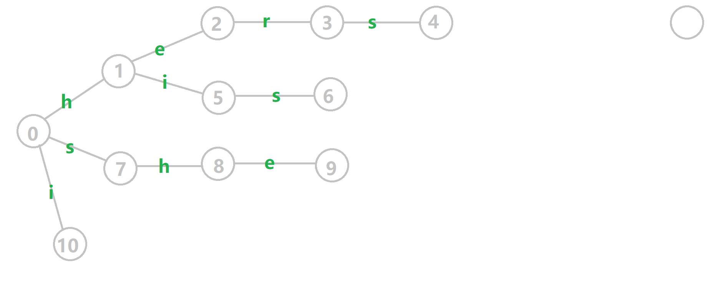
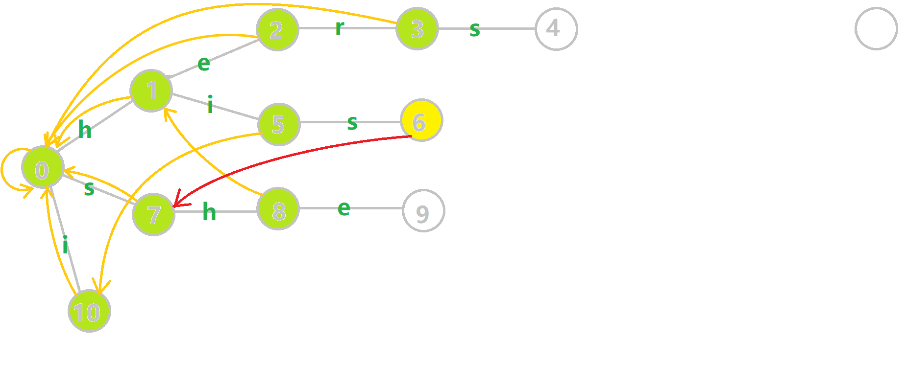
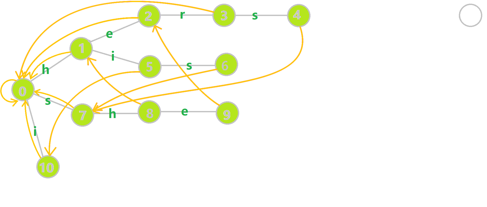
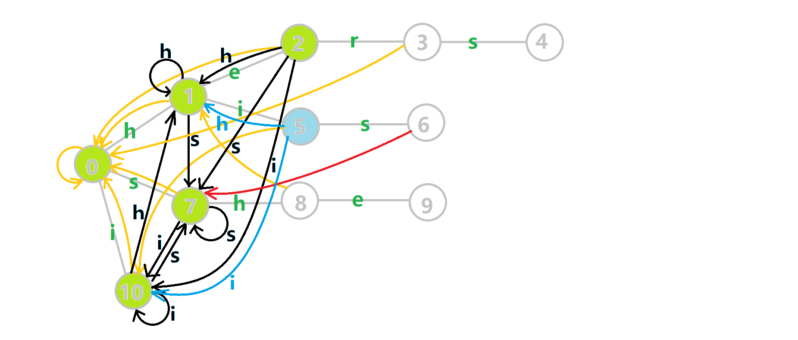
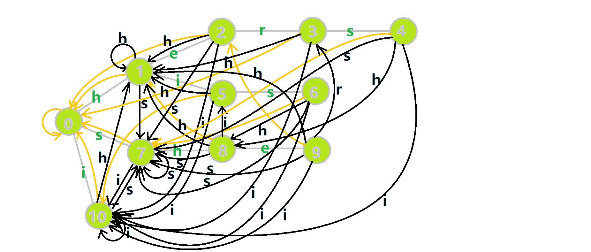
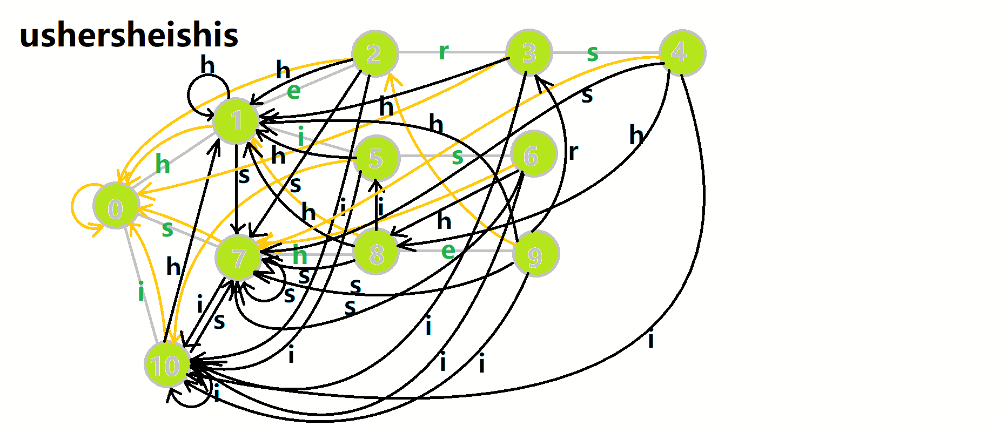

我知道，很多人在第一次看到这个东西的时侯是非常兴奋的。（别问我为什么知道）不过这个自动机啊它叫作`Automaton`，不是`Automation`，让萌新失望啦。切入正题。似乎在初学自动机相关的内容时，许多人难以建立对自动机的初步印象，尤其是在自学的时侯。而这篇文章就是为你们打造的。笔者在自学AC自动机后花费两天时间制作若干的gif，呈现出一个相对直观的自动机形态。尽管这个图似乎不太可读，但这绝对是在作者自学的时侯，画得最~~妙不可读~~的gif了。另外有些小伙伴问这个gif拿什么画的。笔者名誉担保：用Windows画图。

## 概述

AC 自动机是**以 TRIE 的结构为基础**，结合**KMP 的思想**建立的。

简单来说，建立一个 AC 自动机有两个步骤：
1. 基础的 TRIE 结构：将所有的模式串构成一棵 $Trie$。
2. KMP 的思想：对 $Trie$ 树上所有的结点构造失配指针。

然后就可以利用它进行多模式匹配了。

## 字典树构建

AC自动机在初始时会将若干个模式串丢到一个TRIE里，然后在TRIE上建立AC自动机。这个TRIE就是普通的TRIE，该怎么建怎么建。

这里需要仔细解释一下 TRIE 的结点的含义，尽管这很小儿科，但在之后的理解中极其重要。TRIE中的结点表示的是某个模式串的前缀。我们在后文也将其称作状态。一个结点表示一个状态，TRIE的边就是状态的转移。

形式化地说，对于若干个模式串$s_1,s_2\dots s_n$，将它们构建一棵字典树后的所有状态的集合记作 $Q$。

## 失配指针

AC自动机利用一个fail指针来辅助多模式串的匹配。

状态 $u$ 的 fail 指针指向另一个状态 $v$ ，其中 $v\in Q$ ，且 $v$ 是 $u$ 的最长后缀（即在若干个后缀状态中取最长的一个作为 fail 指针）。对于学过KMP的朋友，我在这里简单对比一下这里的 fail 指针与 KMP 中的 next 指针：

1. 共同点：两者同样是在失配的时候用于跳转的指针。
2. 不同点：next 指针求的是最长 Border（即最长的相同前后缀），而 fail 指针指向所有模式串的前缀中匹配当前状态的最长后缀。

因为 KMP 只对一个模式串做匹配，而 AC 自动机要对多个模式串做匹配。有可能 fail 指针指向的结点对应着另一个模式串，两者前缀不同。

没看懂上面的对比不要急（也许我的脑回路和泥萌不一样是吧），你只需要知道，AC 自动机的失配指针指向当前状态的最长后缀状态即可。

AC 自动机在做匹配时，同一位上可匹配多个模式串。

### 构建指针

下面介绍构建 fail 指针的**基础思想**：（强调！基础思想！基础！）

构建 fail 指针，可以参考 KMP 中构造 Next 指针的思想。

考虑字典树中当前的结点 $u$，$u$ 的父结点是 $p$，$p$ 通过字符 `c` 的边指向 $u$，即 $trie[p,c]=u$。假设深度小于 $u$ 的所有结点的 fail 指针都已求得。

1. 如果 $trie[fail[p],c]$ 存在：则让 u 的 fail 指针指向 $trie[fail[p],c]$。相当于在 $p$ 和 $fail[p]$ 后面加一个字符 `c`，分别对应 $u$ 和 $fail[u]$。
2. 如果 $trie[fail[p],c]$ 不存在：那么我们继续找到 $trie[fail[fail[p]],c]$ 。重复 1 的判断过程，一直跳 fail 指针直到根结点。
3. 如果真的没有，就让 fail 指针指向根结点。

如此即完成了 $fail[u]$ 的构建。

### 例子

下面放一张 GIF 帮助大家理解。对字符串 `i` `he` `his` `she` `hers` 组成的字典树构建 fail 指针：

1. 黄色结点：当前的结点 $u$。
2. 绿色结点：表示已经 BFS 遍历完毕的结点，
3. 橙色的边：fail 指针。
4. 红色的边：当前求出的 fail 指针。



我们重点分析结点 6 的 fail 指针构建：



找到 6 的父结点 5，$fail[5]=10$。然而 10 结点没有字母`s`连出的边；继续跳到 10 的 fail 指针，$fail[10]=0$。发现 0 结点有字母`s`连出的边，指向 7 结点；所以 $fail[6]=7$。最后放一张建出来的图



## 字典树与字典图

我们直接上代码吧。字典树插入的代码就不分析了（后面完整代码里有），先来看构建函数 `build()`，该函数的目标有两个，一个是构建fail指针，一个是构建自动机。参数如下：

1. `tr[u,c]` 这个有两者理解方式。我们可以简单理解为字典树上的一条边，即 $trie[u,c]$；也可以理解为从状态（结点） $u$ 后加一个字符`c`到达的状态（结点），即一个状态转移函数 $trans(u,c)$。下文中我们将用第二种理解方式继续讲解。
2. `q` 队列，用于BFS遍历字典树。
3. `fail[u]` 结点 $u$ 的fail指针。

```cpp
void build(){
    for(int i=0;i<26;i++)if(tr[0][i])q.push(tr[0][i]);
    while(q.size()){
        int u=q.front();q.pop();
        for(int i=0;i<26;i++){
            if(tr[u][i])fail[tr[u][i]]=tr[fail[u]][i],q.push(tr[u][i]);
            else tr[u][i]=tr[fail[u]][i];
        }
    }
}
```
为~~关爱萌新~~，笔者大力~~复读~~一下代码：Build 函数将结点按 BFS 顺序入队，依次求 fail 指针。这里的字典树根结点为 0，我们将根结点的子结点一一入队。若将根结点入队，则在第一次 BFS 的时候，会将根结点儿子的 fail 指针标记为本身。因此我们将根结点的儿子。

然后开始 BFS：每次取出队首的结点 u。fail[u] 指针已经求得，我们要求 u 的子结点们的 fail 指针。然后遍历字符集（这里是 0-25，对应 a-z）：

1. 如果 $trans(u,i)$ 存在，我们就将 $trans(u,i)$ 的 fail 指针赋值为 $trans(fail[u],i)$。这里似乎有一个问题。根据之前的讲解，我们应该用 while 循环，不停的跳 fail 指针，判断是否存在字符 `i` 对应的结点，然后赋值。不过在代码中我们一句话就做完这件事了。
2. 否则，$trans(u,i)$ 不存在，就让 $trans(u,i)$ 指向 $trans(fail[u],i)$ 的状态。

接下来解答一下上文提出的问题。细心的同学会发现，`else ` 语句的代码会修改字典树的结构。没错，它将不存在的字典树的状态链接到了失配指针的对应状态。在原字典树中，每一个结点代表一个字符串 $S$，是某个模式串的前缀。而在修改字典树结构后，尽管增加了许多转移关系，但结点（状态）所代表的字符串是不变的。

而 $trans(S,c)$ 相当于是在 $S$ 后添加一个字符 `c` 变成另一个状态 $S'$。如果$S'$存在，说明存在一个模式串的前缀是$S'$，否则我们让 $trans(S,c)$ 指向 $trans(fail[S],c)$。由于$fail[S]$ 对应的字符串是$S$ 的后缀，因此$trans(fail[S],c)$ 对应的字符串也是 $S'$ 的后缀。

换言之在 TRIE 上跳转的时侯，我们只会从 $S$ 跳转到 $S'$，相当于匹配了一个 $S'$；但在AC自动机上跳转的时侯，我们会从$S$跳转到$S'$的后缀，也就是说我们匹配一个字符 `c`，然后舍弃 $S$ 的部分前缀。舍弃前缀显然是能匹配的。那么fail指针呢？它也是在舍弃前缀啊！试想一下，如果文本串能匹配$S$ ，显然它也能匹配 $S$ 的后缀。所谓的 fail 指针其实就是 $S$ 的一个后缀集合。

这样修改字典树的结构，使得匹配转移更加完善。同时它将 fail 指针跳转的路径做了压缩（就像并查集的路径压缩），使得本来需要跳很多次 fail 指针变成跳一次。

好的，我知道大家都受不了长篇叙述。上图！我们将之前的 GIF 图改一下：


1. 蓝色结点： BFS 遍历到的结点 u
2. 蓝色的边：当前结点下，AC自动机修改字典树结构连出的边。
3. 黑色的边：AC自动机修改字典树结构连出的边。
4. 红色的边：当前结点求出的fail指针
5. 黄色的边：fail指针
6. 灰色的边：字典树的边

可以发现，众多交错的黑色边将字典树变成了**字典图**。图中省s略了连向根结点的黑边（否则会更乱）。我们重点分析一下结点 5 遍历时的情况，~~再妙不可读也请大家硬着头皮去读~~。我们求 $trans(5,\text{ s })=6$ 的 fail 指针：



本来的策略是找fail指针，于是我们跳到 $fail[5]=10$发现没有 `s` 连出的字典树的边，于是跳到 $fail[10]=0$ ，发现有$trie[0,\text{ s }]=7$，于是$fail[6]=7$；但是有了黑边、蓝边，我们跳到 $fail[5]=10$ 之后直接走 $trans(10,\text{ s })=7$ 就走到$7$号结点了。~~其实我知道没人会仔细看这鬼扯的两张图片的QAQ~~

这就是 build 完成的两件事：构建 fail 指针和建立字典图。这个字典图也会在查询的时候起到关键作用。

## 多模式匹配

接下来分析匹配函数 `query()`：

```cpp
int query(char *t){
    int u=0,res=0;
    for(int i=1;t[i];i++){
        u=tr[u][t[i]-'a'];// 转移
        for(int j=u;j&&e[j]!=-1;j=fail[j]){
            res+=e[j],e[j]=-1;
        }
    }
    return res;
}
```
声明 $u$ 作为字典树上当前匹配到的结点，$res$ 即返回的答案。循环遍历匹配串，$u$ 在字典树上跟踪当前字符。利用 fail 指针找出所有匹配的模式串，累加到答案中。然后清 0。对 $e[j]$ 取反的操作用来判断 $e[j]$ 是否等于 -1。在上文中我们分析过，字典树的结构其实就是一个 $trans$ 函数，而构建好这个函数后，在匹配字符串的过程中，我们会舍弃部分前缀达到最低限度的匹配。fail指针则指向了更多的匹配状态。最后上一份图。对于刚才的自动机：



我们从根结点开始尝试匹配 `ushersheishis`，那么 p 的变化将是：



1. 红色结点： p 结点
2. 粉色箭头： p 在自动机上的跳转，
3. 蓝色的边：成功匹配的模式串
4. 蓝色结点：示跳 fail 指针时的结点（状态）。

## 总结

~~希望~~大家看懂了文章。其实总结一下，你只需要知道AC自动机的板子很好背就行啦。

???+ note "模板1"

    [LuoguP3808【模板】AC 自动机（简单版）](https://www.luogu.org/problemnew/show/P3808) 

    ```cpp
    #include<bits/stdc++.h>
    using namespace std;
    const int N=1e6+6;
    int n;

    namespace AC{
        int tr[N][26],tot;
        int e[N],fail[N];
        void insert(char *s){
            int u=0;
            for(int i=1;s[i];i++){
                if(!tr[u][s[i]-'a'])tr[u][s[i]-'a']=++tot;
                u=tr[u][s[i]-'a'];
            }
            e[u]++;
        }
        queue<int> q;
        void build(){
            for(int i=0;i<26;i++)if(tr[0][i])q.push(tr[0][i]);
            while(q.size()){
                int u=q.front();q.pop();
                for(int i=0;i<26;i++){
                    if(tr[u][i])fail[tr[u][i]]=tr[fail[u]][i],q.push(tr[u][i]);
                    else tr[u][i]=tr[fail[u]][i];
                }
            }
        }
        int query(char *t){
            int u=0,res=0;
            for(int i=1;t[i];i++){
                u=tr[u][t[i]-'a'];// 转移
                for(int j=u;j&&e[j]!=-1;j=fail[j]){
                    res+=e[j],e[j]=-1;
                }
            }
            return res;
        }
    }

    char s[N];
    int main(){
        scanf("%d",&n);
        for(int i=1;i<=n;i++)scanf("%s",s+1),AC::insert(s);
        scanf("%s",s+1);
        AC::build();
        printf("%d",AC::query(s));
        return 0;
    }
    ```

???+ note "模板2"

    [P3796 【模板】AC 自动机（加强版）](https://www.luogu.org/problemnew/show/P3796)

    ```cpp
    #include<bits/stdc++.h>
    using namespace std;
    const int N=156,L=1e6+6;
    namespace AC{
        const int SZ=N*80;
        int tot,tr[SZ][26];
        int fail[SZ],idx[SZ],val[SZ];
        int cnt[N];// 记录第 i 个字符串的出现次数
        void init(){
            memset(fail,0,sizeof(fail));
            memset(tr,0,sizeof(tr));
            memset(val,0,sizeof(val));
            memset(cnt,0,sizeof(cnt));
            memset(idx,0,sizeof(idx));
            tot=0;
        }
        void insert(char *s,int id){//id 表示原始字符串的编号
            int u=0;
            for(int i=1;s[i];i++){
                if(!tr[u][s[i]-'a'])tr[u][s[i]-'a']=++tot;
                u=tr[u][s[i]-'a'];
            }
            idx[u]=id;
        }
        queue<int> q;
        void build(){
            for(int i=0;i<26;i++)if(tr[0][i])q.push(tr[0][i]);
            while(q.size()){
                int u=q.front();q.pop();
                for(int i=0;i<26;i++){
                    if(tr[u][i])fail[tr[u][i]]=tr[fail[u]][i],q.push(tr[u][i]);
                    else tr[u][i]=tr[fail[u]][i];
                }
            }
        }
        int query(char *t){// 返回最大的出现次数
            int u=0,res=0;
            for(int i=1;t[i];i++){
                u=tr[u][t[i]-'a'];
                for(int j=u;j;j=fail[j])val[j]++;
            }
            for(int i=0;i<=tot;i++)if(idx[i])res=max(res,val[i]),cnt[idx[i]]=val[i];
            return res;
        }
    }
    int n;
    char s[N][100],t[L];
    int main(){
        while(~scanf("%d",&n)){if(n==0)break;
            AC::init();
            for(int i=1;i<=n;i++)scanf("%s",s[i]+1),AC::insert(s[i],i);
            AC::build();
            scanf("%s",t+1);
            int x=AC::query(t);
            printf("%d\n",x);
            for(int i=1;i<=n;i++)if(AC::cnt[i]==x)printf("%s\n",s[i]+1);
        }
        return 0;
    }
    ```


## KMP 自动机

最后介绍自动机和 KMP 自动机，供学有余力的朋友观赏。

有限状态自动机 (DFA)：字符集，有限状态控制，初始状态，接受状态。

KMP 自动机：一个不断读入待匹配串，每次匹配时走到接受状态的 DFA。

共有 $m$ 个状态，第 $i$ 个状态表示已经匹配了前 $i$ 个字符。

定义 $trans_{i,c}$ 表示状态 $i$ 读入字符 $c$ 后到达的状态， $next_{i}$ 表示[prefix function](/string/prefix-function)，则有：

$$
trans_{i,c} =
\begin{cases}
i + 1,  & \text{if $b_{i} = c$} \\[2ex]
trans_{next_{i},c}, & \text{else}
\end{cases}
$$

（约定 $next_{0}=0$ ）

我们发现 $trans_{i}$ 只依赖于之前的值，所以可以跟[KMP](/string/prefix-function/##knuth-morris-pratt)一起求出来。

时间和空间复杂度： $O(m|\Sigma|)$。

一些细节：走到接受状态之后立即转移到该状态的 $next$。

