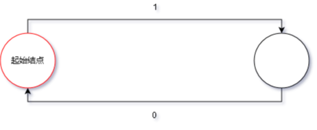

在 OI 中，我们所说的“自动机”一般都指“确定有限状态自动机”。

自动机是 OI 中被广泛使用的一个数学模型，其思想在许多字符串算法中都有涉及，因此我们推荐您在学习一些字符串算法（ [KMP](./kmp.md) 、 [AC 自动机](./ac-automaton.md) 、 [SAM](./sam.md) ）前先完成自动机的学习。学习自动机有助于理解上述算法。

## 前置知识

-   基础图论（太基础了以至于没有内链）。

## 自动机入门

首先理解一下自动机是用来干什么的：自动机是一个对字符串进行判定的数学模型。

这句话涉及到的名词比较多，逐一解释一下。“信号序列”是指一连串有顺序的信号，例如字符串从前到后的每一个字符、数组从 1 到 n 的每一个数、数从高到低的每一位等。“判定”是指针对某一个命题给出或真或假的回答。有时我们需要对一个信号序列进行判定。一个简单的例子就是判定一个二进制数是奇数还是偶数，较复杂的例子例如判定一个字符串是否回文，判定一个字符串是不是某个特定字符串的子序列等等。

自动机的工作原理和地图很类似。假设你在你家，然后你从你家到学校，按顺序经过了很多路口。每个路口都有岔路，而你在所有这些路口的选择就构成了一个序列。

例如，你的选择序列是“家门 -> 右拐 -> 萍水西街 -> 尚园街 -> 古墩路 -> 地铁站 -> 下宁桥”，那你按顺序经过的路口可能是“家 -> 家门口 -> 萍水西街竞舟北路口 -> 萍水西街尚圆街路口 -> 尚园街古墩路口 -> 古墩路中 -> 三坝地铁站 -> 下宁桥地铁站”。可以发现，上学的选择序列不止这一个。同样要去地铁站，你还可以从竞舟北路绕道，或者横穿文鼎苑抄近路。

而我们如果找到一个选择序列，就可以在地图上比划出这个选择序列能不能去学校。比如，如果一个选择序列是“家门 -> 右拐 -> 萍水西街 -> 尚园街 -> 古墩路 -> 地铁站 -> 钱江路 -> 四号线站台 -> 联庄”，那么它就不会带你去同一个学校，但是仍旧可能是一个可被接受的序列，因为目标地点可能不止一个。

也就是说，我们通过这个地图和一组目的地，将信号序列分成了三类，一类是无法识别的信号序列（例如“家门 ->asdfawe”），一类是能去学校的信号序列，另一类是不能的信号序列。我们将所有合法的信号序列分成了两类，完成了一个判定问题。

既然自动机是一个数学模型，那么显然不可能是一张地图。众所周知，对地图进行抽象之后，可以简化为一个有向图。因此，自动机的结构就是一张有向图。

而自动机的工作方式和流程图类似，不同的是：自动机的每一个结点都是一个判定结点；自动机的结点只是一个单纯的状态而非任务；自动机的边可以接受多种字符（不局限于 T 或 F）。

例如，完成“判断一个二进制数是不是偶数”的自动机如下：

从起始结点开始，从高到低接受这个数的二进制序列，然后看最终停在哪里。如果最终停在红圈结点，则是偶数，否则不是。

如果需要判定一个有限的信号序列和另外一个信号序列的关系（例如另一个信号序列是不是某个信号序列的子序列），那么常用的方法是针对那个有限的信号序列构建一个自动机。这个在学习 KMP 的时候会讲到。

需要注意的是，自动机只是一个 **数学模型** ，而 **不是算法** ，也 **不是数据结构** 。实现同一个自动机的方法有很多种，可能会有不一样的时空复杂度，也可能会有不一样的代码长度。

接下来你可以选择继续看自动机的形式化定义，也可以去学习 [KMP](./kmp.md) 、 [AC 自动机](./ac-automaton.md) 或 [SAM](./sam.md) 了。

## 形式化定义

一个 **确定有限状态自动机（DFA）** 由以下五部分构成：

1.   **字符集** （ $\Sigma$ ），该自动机只能输入这些字符。
2.   **状态集合** （ $Q$ ）。如果把一个 DFA 看成一张有向图，那么 DFA 中的状态就相当于图上的顶点。
3.   **起始状态** （ $start$ ）， $start\in Q$ ，是一个特殊的状态。起始状态一般用 $s$ 表示，为了避免混淆，本文中使用 $start$ 。
4.   **接受状态集合** （ $F$ ）， $F\subseteq Q$ ，是一组特殊的状态。
5.   **转移函数** （ $\delta$ ）， $\delta$ 是一个接受两个参数返回一个值的函数，其中第一个参数和返回值都是一个状态，第二个参数是字符集中的一个字符。如果把一个 DFA 看成一张有向图，那么 DFA 中的转移函数就相当于顶点间的边，而每条边上都有一个字符。

DFA 的作用就是识别字符串，一个自动机 $A$ ，若它能识别（接受）字符串 $S$ ，那么 $A(S)=True$ ，否则 $A(S)=False$ 。

当一个 DFA 读入一个字符串时，从初始状态起按照转移函数一个一个字符地转移。如果读入完一个字符串的所有字符后位于一个接受状态，那么我们称这个 DFA **接受** 这个字符串，反之我们称这个 DFA **不接受** 这个字符串。

如果一个状态 $v$ 没有字符 $c$ 的转移，那么我们令 $\delta(v,c)=null$ ，而 $null$ 只能转移到 $null$ ，且 $null$ 不属于接受状态集合。无法转移到任何一个接受状态的状态都可以视作 $null$ ，或者说， $null$ 代指所有无法转移到任何一个接受状态的状态。

我们扩展定义转移函数 $\delta$ ，令其第二个参数可以接收一个字符串： $\delta(v,s)=\delta(\delta(v,s[1]),s[2..|s|])$ ，扩展后的转移函数就可以表示从一个状态起接收一个字符串后转移到的状态。那么， $A(s)=[\delta(start,s)\in F]$ 。

如，一个接受且仅接受字符串 "a", "ab", "aac" 的 DFA：

## OI 中常用的自动机

### 字典树

 [字典树](./trie.md) 是大部分 OIer 接触到的第一个自动机，接受且仅接受指定的字符串集合中的元素。

转移函数就是 Trie 上的边，接受状态是将每个字符串插入到 Trie 时到达的那个状态。

### KMP 自动机

 [KMP 算法](./kmp.md) 可以视作自动机，基于字符串 $s$ 的 KMP 自动机接受且仅接受以 $s$ 为后缀的字符串，其接受状态为 $|s|$ 。

转移函数：

$$
\delta(i, c)=
\begin{cases}
i+1&s[i+1]=c\\
0&s[1]\ne c\land i=0\\
\delta(\pi(i),c)&s[i+1]\ne c\land i>0
\end{cases}
$$

### AC 自动机

 [AC 自动机](./ac-automaton.md) 接受且仅接受以指定的字符串集合中的某个元素为后缀的字符串。也就是 Trie + KMP。

### 后缀自动机

 [后缀自动机](./sam.md) 接受且仅接受指定字符串的后缀。

### 广义后缀自动机

 [广义后缀自动机](./general-sam.md) 接受且仅接受指定的字符串集合中的某个元素的后缀。也就是 Trie + SAM。

广义 SAM 与 SAM 的关系就是 AC 自动机与 KMP 自动机的关系。

### 回文自动机

 [回文自动机](./pam.md) 比较特殊，它不能非常方便地定义为自动机。

如果需要定义的话，它接受且仅接受某个字符串的所有回文子串的 **中心及右半部分** 。

“中心及右边部分”在奇回文串中就是字面意思，在偶回文串中定义为一个特殊字符加上右边部分。这个定义看起来很奇怪，但它能让 PAM 真正成为一个自动机，而不仅是两棵树。

### 序列自动机

 [序列自动机](./seq-automaton.md) 接受且仅接受指定字符串的子序列。

## 后缀链接

由于自动机和匹配有着密不可分的关系，而匹配的一个基本思想是“这个串不行，就试试它的后缀可不可以”，所以在很多自动机（KMP、AC 自动机、SAM、PAM）中，都有后缀链接的概念。

一个状态会对应若干字符串，而这个状态的后缀链接，是在自动机上的、是这些字符串的公共真后缀的字符串中，最长的那一个。

一般来讲，后缀链接会形成一棵树，并且不同自动机的后缀链接树有着一些相同的性质，学习时可以加以注意。

## 扩展阅读

在计算复杂性领域中，自动机是一个经典的模型。并且，自动机与正则语言有着密不可分的关系。

如果对相关内容感兴趣的话，推荐阅读博客 [计算复杂性（1) Warming Up: 自动机模型](https://lingeros-tot.github.io/2019/03/05/Warming-Up-自动机模型/) 。
