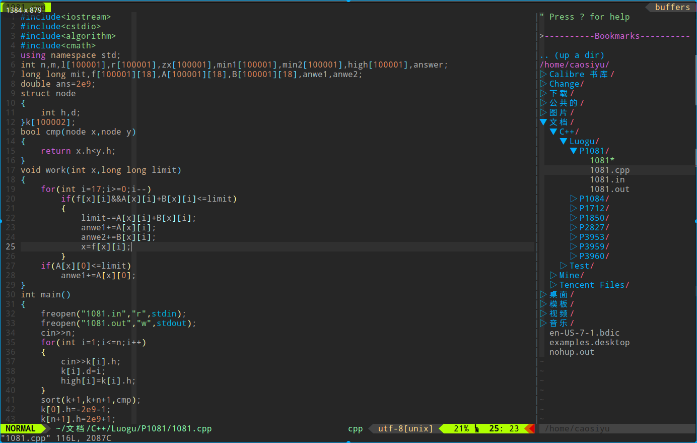
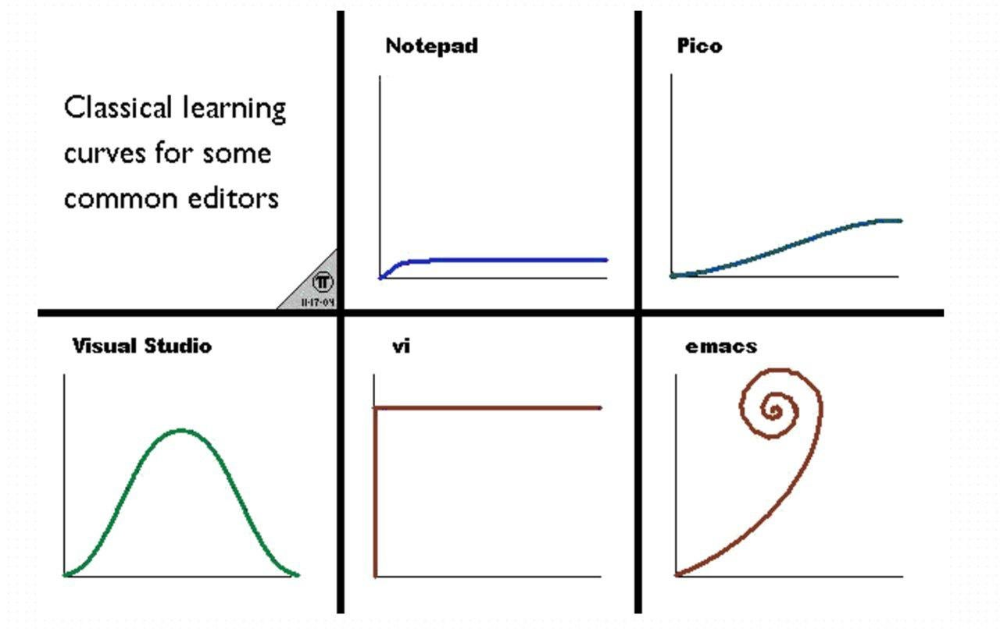

author: Enter-tainer, ouuan, Xeonacid, Ir1d, partychicken, ChungZH, LuoshuiTianyi, Kewth, s0cks5, Doveqise, StudyingFather, SukkaW, SodaCris

Vim，编辑器之神。

## 简介

Vim 是从 vi 发展出来的一个文本编辑器。其代码补完、编译及错误跳转等方便编程的功能特别丰富，在程序员中被广泛使用，和 [Emacs](emacs.md) 并列成为类 Unix 系统用户最喜欢的编辑器。

## 安装

### 系统自带

Linux 系统通常自带 Vim，打开终端输入 `vim` 即可启用。

### 手动安装

#### Windows

直接前往官网下载 [安装包](https://ftp.nluug.nl/pub/vim/pc/gvim82.exe) ，然后按步骤安装即可。

#### Linux

系统自带的 `vim` （即直接使用 `apt install vim` 得到的）可能是 `vim-tiny` 或者 `vim-basic` ，缺少一些功能（如部分语言高亮、剪贴板支持等），具体可通过 `vim --version` 查看。此时，可以尝试安装 `vim-gtk3` ，以获得更多的功能。

如果你需要使用到比系统自带的 vim 的更新版本中具有的功能（如 8.1 开始增加的 `termdebug` 插件），则可采取以下两种方法：

如果没有相关需求，就没有必要手动安装了，可以直接略过本节。


安装有两种做法。

做法一，使用命令安装。但因为系统安装的时候 Vim 是从默认软件源安装的，所以软件源里 Vim 的版本并不是最新的。这个时候应使用第三方软件源安装，命令如下：

```bash
sudo add-apt-repository ppa:jonathonf/vim
sudo apt-get update
sudo apt-get install vim
```

静待安装完成即可。

做法二，先到 [Releases - vim/vim](https://github.com/vim/vim/releases) 下载源码包，然后解压，并进入解压后的文件夹，并打开终端，cd 至文件夹路径，并依次输入如下命令：

```bash
sudo apt-get install python-dev
sudo apt-get install python3-dev
sudo apt-get install libncurses5-dev
./configure
make
sudo make install
```

make 的过程可能稍久，需耐心等待。

最后在终端输入

```bash
vim
```

如果出现 Help poor children in Uganda!（帮助乌干达的可怜儿童！）的一长串文本，说明安装成功。[^note1]

## 编译

要编译 C++ 文件，先要安装 g++。命令如下：

```bash
sudo apt-get install build-essential
```

接着通过 `cd` 命令进入 cpp 文件的路径，然后执行如下命令：

```bash
# 编译
g++ filename.cpp -o filename
# 运行
./filename
```

一键编译运行的配置在配置篇给出。

## 基础篇：Vim 的模式与常用键位

Vim 的基础操作在 Vim 自带的教程里将会讲述。打开终端输入

```shell
vimtutor
```

即可进入教程。这些操作通常需要二三十分钟来大致熟悉。

### 插入模式 (insert)

从普通模式进入插入模式有数个键位：

- <kbd>a</kbd>：往后挪一个字符插入文本。
- <kbd>A</kbd>：移动到当前行尾插入文本。
- <kbd>i</kbd>：在光标当前位置插入文本。
- <kbd>I</kbd>：移动到当前行头插入文本。
- <kbd>o</kbd>：在当前行的下一行新建一行，并插入文本。
- <kbd>O</kbd>：在当前行的上一行新建一行，并插入文本。

返回普通模式的键位是<kbd>Esc</kbd>键；亦可使用快捷键<kbd>Ctrl</kbd>+<kbd>\[</kbd>。

有的时候用户只是需要进入普通模式下按一次小命令，按两次快捷键来回切换又略显浪费时间。Vim 提供了「插入 - 普通模式」来解决这个问题。在插入模式下，按<kbd>Ctrl</kbd>+<kbd>o</kbd>即可进入此模式，执行完一次操作后又会自动回到插入模式。

### 普通模式 (normal)

Vim 的命令大部分都是在普通模式下完成的。普通模式下可不能乱按，可以说每个键都是命令。

Vim 的方向键是<kbd>h</kbd>、<kbd>j</kbd>、<kbd>k</kbd>、<kbd>l</kbd>。熟练之后能极大提升操作速度。

```text
     k
     ^
h <     > l
     v
     j
```

 `x` 用于删除光标后的一个字符。

 `d` 命令也是删除，通常配合其他键使用。

 `u` 是撤销的快捷键，作用是撤销上一次对文本的更改。普通模式下的 `x` 、 `d` 、 `p` 命令都会被撤销。进入一次插入模式所编辑的文本也算一次更改，撤销命令会删去从进入到退出插入模式所输入的所有东西。与之对应的是<kbd>Ctrl</kbd>+<kbd>r</kbd>命令，它的作用是撤销上次的撤销命令，相当于大部分 Windows 下程序中的<kbd>Ctrl</kbd>+<kbd>y</kbd>。

 `y` 命令可以复制被选中的区域。需要按 `v` 进入可视模式操作。

 `w` 可以跳到下个单词的开头； `e` 可以跳到当前单词结尾； `0` 可以跳至行首； `$` 可以跳至行尾。 `w` 、 `e` 、 `0` 、 `$` 还可以与其他命令组合，比如 `de` 、 `dw` 、 `d0` 和 `d&` 分别对应删至单词尾、删至下个单词头、删至行首和删至行尾。

由于对行命令的使用很频繁，所以大部分的单键命令都可以通过按两次来实现对行操作。例如， `dd` 可以删除一整行； `yy` 可以复制当前行。

在输入某个命令前，输入一个数字 n 的话，命令就会重复 n 次。如在普通模式下：

```vim
asdasdasdasdasd
asdadasdddd
asdasdasd
```

光标正位于第一行，该如何删除这三行呢？普通模式下输入 `3 dd` 即可。

 `.` 命令可以重复上次执行的命令。

 `gg` 命令可跳至代码的开头； `G` 命令可跳至代码最后一行； `G` 命令前加数字可跳至指定行。

普通模式下按<kbd>/</kbd>，下方即会出现查找框，输入需要查找的字符，按回车后就能查看搜索结果。如果有多个查找结果，按<kbd>n</kbd>即可跳至下一个查找结果；按<kbd>N</kbd>可跳至上一个。

### 命令行模式

其实这并不能称作是一个模式。

普通模式下只需要按<kbd>:</kbd>，下方就会蹦出命令框，继续输入相关命令即可。

输入 `:help` 可以查看英文版 Vim 在线帮助文档（看不懂英文可以下载 Vim 中文用户手册，或者移步插件篇下载 vimcdoc）。

 `:q` 是退出； `:w` 是保存； `:wq` 是保存并退出； `:q!` 是不保存并退出。

 `:e filename` 可以打开当前目录下的指定文件。

 `:s` 命令是替换。

```vim
" 把当前行第一个匹配的 str1 替换成 str2
:s/str1/str2/
" 把当前行所有的 str1 替换成 str2
:s/str1/str2/g
" 把第 x1 行至 x2 行中，每一行第一个匹配的 str1 替换成 str2
:x1,x2 s/str1/str2/
" 把第 x1 行至 x2 行中所有的 str1 替换成 str2
:x1,x2 s/str1/str2/g
" 把所有行第一个匹配的 str1 替换成 str2
:%s/str1/str2/
" 把全文件所有的 str1 替换成 str2
:%s/str1/str2/g
```

如果命令形式是 `:! command` ，则命令将在 bash 终端执行。

### 可视模式

按 `v` 进入可视模式，多用于选中区域。

进入可视模式后，按下<kbd>h</kbd>、<kbd>j</kbd>、<kbd>k</kbd>、<kbd>l</kbd>可以移动高亮选区。如果不小心跑反了，可以按 `o` 键切换活动端。如果需要鼠标操作，可以将 `set mouse=a` 写入配置文件，这样就能使用鼠标选中区域并进行复制操作。

选中后输入 `y` 或 `d` 亦可执行相应命令。

## 进阶篇

### 缩小控制区域

为什么 Emacs 和 Vim 这些编辑器效率高？很重要的一点在于，这些编辑器可以让双手始终处于主键盘区域并且保持合作状态，而不会出现一只手不停地按而另一只手摊在键盘上的情况。

可以通过这几行丧心病狂的配置来极速适应使用<kbd>h</kbd>、<kbd>j</kbd>、<kbd>k</kbd>、<kbd>l</kbd>移动：

```vim
" 使方向键失效
imap <UP> <Nop>
imap <DOWN> <Nop>
imap <LEFT> <Nop>
imap <RIGHT> <Nop>
```

还可以进一步缩小双手需要控制的区域：

- 用<kbd>Ctrl</kbd>+<kbd>h</kbd>代替<kbd>Backspace</kbd>（甚至可以在终端里这样用）。
- 用<kbd>Ctrl</kbd>+<kbd>m</kbd>代替回车（甚至可以在终端里这样用）。
- 在绝大多数的情况下，不要去按右边的<kbd>Ctrl</kbd>和<kbd>Shift</kbd>，用左边的代替。

### 对调 Esc 键与 CapsLock 键

> 键盘上的<kbd>Esc</kbd>键太远了，小拇指都按得不顺手。诶，我又不小心碰到大小写锁定切换键了！这个<kbd>CapsLock</kbd>键实在太没用了，不仅难用到，而且这么顺手这么近，还容易错按到，我要它何用？能不能把它和<kbd>Esc</kbd>换一下？

的确可以。在终端中输入：

```bash
sudo vim /usr/share/X11/xkb/symbols/pc
```

找到 `key <ESC>` 与 `key <CAPS>` 这两行，调换两行的中括号 `[]` 中的内容。注销再重新进入系统后，它们就换过来了。

对于使用考场设备，拿不到管理员权限的情况，可以在终端输入如下命令：

```bash
xmodmap -e 'clear Lock' -e 'keycode x042=Escape'
```

该映射重启设备失效，因此不用担心修改考场设备的问题。

### 重复，重复，重复

毫无疑问，对动作的重复是提高效率最直接的办法，也是对效率最直接的反映。Vim 中，用于重复执行指令的方式有<kbd>.</kbd>命令，简单的录制与重复宏与 `normal` 命令。

####  `.` 命令

Vim 的使用者不可避免地会抗拒重复的文本修改，因为 Vim 注定比其他编辑器会多出两次按键——<kbd>Esc</kbd>与<kbd>i</kbd>。但是，Vim 其实提供了重复命令 `.` ，它适用于重复的添加、修改、删除文本操作。

 `.` 命令可以重复上次执行的命令。但是这个「命令」并不只限于单一的命令，它也可以是 `数字 + 命令` 的组合； `进入插入模式 + 输入文本 + Esc` 也是命令的一种。所以，适当使用 `.` 命令才能达到最高的效率。

例如，如下代码的每一行末尾都少了分号：

    int a, b
    cin >> a >> b
    cout << a + b
    return 0

将 `.` 与搭配移动到行尾插入命令 `A` 使用，就能高效地补上末尾的分号。

```vim
A;<Esc>
" 重复下面的命令
j.
```

再例如，如下代码中，后面五个赋值语句的数组名全部写错了：

```cpp
int check() {
  book[1] = 1, book[2] = 1, book[3] = 1, bok[1] = 1, bok[2] = 1, bok[3] = 1,
  bok[4] = 1, bok[5] = 1;
}
```

一个个改过于麻烦，而命令行模式的 `s` 命令又会全部改掉。

第一种改法是搭配普通模式下的 `s` 命令（删除光标处字符并进入插入模式）使用。来到第一个错误的数组名首字母处，按下 `4s` ，输入正确的数组名并退出。之后把光标一个个移过去，再使用 `.` 命令。

第二种比较节省时间的改法是利用查找模式修改。键入 `/book` ，接着按下回车，并使用 `n` 键来到第一个错误的数组名首字母处，键入 `4s 新数组名 <Esc>` ，最后重复 `n.` 。

第三种改法是简易查找命令 `f` 。在一行中普通模式下， `f + 单个字符` 即可查找此行中出现的这个字符并将光标移至字符处；按 `;` 查找下一个， `,` 查找上一个。所以对于上面的代码，只需键入 `fb;;;` 之后进入插入模式修改，然后 `;.` 即可。这种改法适用于只需行内移动的情况。

#### 宏

Vim 的宏功能可以重复任意长的命令。

使用宏之前要先“录制”，即把一串按键操作录下来再回放，这样就达到了重复的效果。录制的方法很简单，普通模式下键入 `q` 开始录制。下一步，为录制的宏指定一个执行的命令键，可以按下 26 个字母中的任意一个来指定。这时左下方会显示 `记录中 @刚刚选择的字母` 。然后就可以开始录制命令了。同理，普通模式下按 `q` 暂停录制。

使用方法为按下 `:` 进入命令行模式，键入 `@选择的记录字母` ，然后之前录制的命令就被调用了。

将 `.` 和宏组合，即录制宏 → 调用宏 → `.` 重复命令 → 数字 + `.` ，可以达到非常高的效率。

#### normal 命令

该命令与普通模式有关，效果是在指定行重复命令。

按 `:` 进入命令行模式，输入如下命令：

```vim
:a,b normal command
```

这行命令的意思是在普通模式下，对 a~b 行执行 `command` 命令。

由于 `normal` 命令可以被 `.` 命令重复调用，且其易于理解，它的使用频率甚至更高于宏。

#### 数字 + `.` + 宏 + normal

单个命令并不能完全体现出它们的强大，命令组合使用的时候才是它们最强大的时侯。

例如：

> 我下载了一本书，我需要它的每一个章节都变成「标题」，以方便转换成 mobi 之类的格式，或者方便生成 TOC 目录跳转，怎么办呢？几千个章节哪里好处理哇。

以下是用 Vim 处理的过程：

1. 按下<kbd>/</kbd>调出查找框，输入正则表达式进行查找；
2. 用 `q` 命令开始录制宏；
3. 键入 `I#` 命令，然后按下<kbd>ESC</kbd>；
4. 用 `q` 进行修改操作并结束宏录制；
5. 键入 `normal n@字母` 转到下一处并重复上一步操作；
6. 键入 `数字 + .` 多次重复。

## 插件篇

Vim 与 Emacs 之所以能成为两大巅峰神器，是因为其高度的扩展与可定制性，而最能体现这一特性的就是插件了。

虽然考场上基本上不能用插件，但是日常的学习中，插件能大大提高效率，而且一些插件的部分功能可以通过 Vim 自带实现以及配置实现。

### 插件管理器 vim-plug

以前，安装 Vim 的插件十分麻烦且易出错。在这种情况下，一款强大的插件管理器 **vim-plug** 应运而生。

在开始安装插件之前，先往配置里写入如下两行

```vim
set nocompatible
filetype plugin on
```

以确保 Vim 可以加载插件，哪怕是 Vim 原生内置的插件也需要的。

安装 vim-plug 的具体过程如下：

1. 首先是在 home 目录下建立文件夹 .vim；
2.  打开终端输入以下命令：

    ```bash
    curl -fLo ~/.vim/autoload/plug.vim --create-dirs \
        https://raw.githubusercontent.com/junegunn/vim-plug/master/plug.vim
    ```

vim-plug 可以轻松管理插件，只需要在配置中写一下，并在 Vim 中执行 `:PlugInstall` 命令，就可以自动从 GitHub 上拉取插件（当然也拉取不了 GitHub 上没有的）。而如果不想用了什么插件也无须删去，在配置中注释掉该插件的相关行就行了。

### 文件管理

使用 Vim 的时候，打开文件很不方便。不论是在目标文件夹下利用 `vim filename` 打开文件，还是在 Vim 内使用 `:e filename` 来打开文件，显然都过于麻烦。

为了解决这个问题，Vim 的用户们开发了 **NERDTree** 这一插件。它的源码托管在 [preservim/nerdtree](https://github.com/preservim/nerdtree) 上。这个插件达到了一种类似于 VS Code 中工程目录树的效果，只需在左侧目录栏选中相应文件即可打开相应文件。

NERDTree 的开启方式是在 Vim 中输入 `:NERDTreeToggle` ，它会在左侧打开一个侧边栏窗口。它的其他快捷键可以参看 [NERDTree 快捷键辑录](http://yang3wei.github.io/blog/2013/01/29/nerdtree-kuai-jie-jian-ji-lu/) 。

另外，Vim 自带了一个稍逊一筹的文件管理器 **netrw** 。在终端中可以使用

```bash
vim 文件夹路径
```

打开目录插件。在 Vim 中的命令是

```bash
e 文件夹路径
```

在上述两个命令中可以用 `.` 来表示当前工作目录，所以可以在终端中用 `vim .` ，或者在 Vim 中使用 `e .` 来开启插件。

当然，如果仅是如此还不够。使用文件管理器打开文件的话，容易使工作目录出现差错，从而导致编译的程序不存在于原文件夹中，所以还需在配置文件中加入以下语句：

```vim
set autochdir
```

它的作用是会自动把工作目录移动到当前编辑文件所在目录。

### 美化界面

Vim 依附于终端，所以调整终端设置也可以达到美化效果。比如背景透明这种极具美感的东西。而 Gvim 则可以通过图形界面的菜单栏来调节。

字体可以在终端中设置。

 **vim-airline** 是一个美化状态栏的插件。当插件正确加载的时候，每个 Vim 窗口的底端都会出现美化后的状态栏，显示效果类似 Oh My Zsh。

美化前：

美化后：

vim-airline 的源码托管在 [vim-airline/vim-airline](https://github.com/vim-airline/vim-airline) 。

主题掌管着语法高亮的色彩、背景颜色等等。以 onedark 主题为例，使用主题的方法如下：

1. 在 `.vim` 文件夹下建立 `colors` 文件夹；
2. 将后缀名为 `.vim` 的主题文件放入其中。本例中要放入的文件名为 `onedark.vim` 。



### 启动界面

一个可有可无的插件。插件名为 [vimplus-startify](https://github.com/chxuan/vimplus-startify) ，安装后能通过快捷键打开历史记录。

### 小方便性插件

-  [vim-commentary](https://github.com/tpope/vim-commentary) ：快捷键 `gc` 注释选中行， `gcu` 撤销上次注释。

-  [ale](https://github.com/dense-analysis/ale) ： `:w` 保存时提示语法错误，并且可以开启与 `airline` 的携同，状态栏上也会显示 `Error` 和 `Warning` 。

-  [easymotion](https://github.com/easymotion/vim-easymotion) ：快速跳转。

-  [rainbow](https://github.com/luochen1990/rainbow) ：彩虹括号，使具有包含关系的括号显现出不同的颜色，增强多括号代码的可读性……

-  [delimitMate](https://github.com/Raimondi/delimitMate_) ：括号补全功能。考试中可用配置实现部分功能，见配置篇。

-  [vimcdoc](https://github.com/yianwillis/vimcdoc) ：汉化 Vim 在线文档。

-  [gundo](https://github.com/sjl/gundo.vim) ：这个插件能够像 git 一样显示文件修改树。Vim 中键入 `:GundoToggle` 即可在左侧打开时光机。使用前需要在 Vim 里开启 Python 支持。

-  [vimim](https://vim.sourceforge.io/scripts/script.php?script_id=2506) ：相当于给 Vim 安装中文输入法。安装方法为在 `.vim` 文件夹中创建文件夹 `plugin` ，然后点击 [vimim 下载链接](https://www.vim.org/scripts/download_script.php?src_id=23122) 下载文件，最后放入此文件夹中。使用方法为打开 Vim 并进入插入模式，按下<kbd>Ctrl</kbd>+<kbd>/</kbd>即可启用。但是该插件使用的是云词库，若没网就会卡死。所以建议下载 [本地超大词库](https://github.com/vimim/vimim/raw/master/plugin/vimim.gbk.bsddb) ，与插件一并放入 `plugin` 文件夹中，与插件脚本同目录即可启用。

-  [vim-instant-markdown](https://github.com/suan/vim-instant-markdown) ：一个即时预览 Markdown 文件的插件。打开 Markdown 文件时会自动在浏览器中打开一个标签页，实时预览 Vim 中正在编辑的 Markdown 文件的内容。

## 配置篇

Vim 的配置语言称为 vim script，语法和 Vim 命令行下的命令一模一样，存储在配置文件中。基础语法就是 `set` 开启选项， `call xxx()` 调用函数， `func` 与 `endfunc` 定义函数， `exec` 执行命令， `if` 和 `endif` 描述以下条件表达式， `"` 表示注释， `source` 表示应用。Vim 开启时会自动执行配置文件中的每一行语句。

### 基础配置

使用各种插件容易与 vi 的模式产生冲突，所以要在配置里关闭 vi 的功能：

```vim
set nocompatible
```

将高亮支持和语法高亮重新开启：

```vim
syntax enable
syntax on
```

设置状态栏。将状态栏设为总是显示：

```vim
set laststatus=2
```

而状态栏所显示的信息在配置中是可以设置的。设置如下：

```vim
set statusline=\ %<%F[%1*%M%*%n%R%H]%=\ %y\ %0(%{&fileformat}\ [%{(&fenc==\"\"?&enc:&fenc).(&bomb?\",BOM\":\"\")}]\ %c:%l/%L%)
```

上述命令会使状态栏显示文件路径、模式、文件类型、文件编码、所在行数与列数，以及光标所在处是文件的百分之多少。配合 vim-airline 插件使用效果更佳。

默认情况下换行符是不可被删除的，除非使用 `dd` 命令或者 `J` 命令才可做到。如下配置可以解除这种限制：

```vim
set backspace=indent,eol,start
```

没有行号的显示肯定是崩溃的。如下配置可以开启行号显示的功能：

```vim
set number
```

Vim 自带自动折行功能，即当某一行超过了 Vim 窗口边界的时候，多出的部分会自动显示在下一行，而这种多出来的行前面是没有行号的，比较好辨认，这些行被称为屏幕行，而根据行号一一对应的便称作实际行（ `g + 移动命令` 可以在屏幕行间移动）。但是仅仅凭着看前面的行号来辨认某个折下来的行属于哪个实际行的话，还是不够快。如下命令可以开启高亮显示当前行的功能：

```vim
set cursorline
```

以下两行配置能够禁止生成临时文件 swap：

```vim
set nobackup            " 设置不备份
set noswapfile          " 禁止生成临时文件
```

设置主题，其中 themename 是主题的名字：

```vim
colorscheme themename
```

前文提过的几个配置：

```vim
set mouse=a              " 开启鼠标支持
set fillchars=vert:\ ,stl:\ ,stlnc:\
                         " 在分割窗口间留出空白
set autochdir            " 移至当前文件所在目录
```

设置文件编码：

```vim
set langmenu=zh_CN.UTF-8
set helplang=cn
set termencoding=utf-8
set encoding=utf8
set fileencodings=utf8,ucs-bom,gbk,cp936,gb2312,gb18030
```

如果安装了 Oh my Zsh，还可以加入对 Zsh 的支持：

```vim
set wildmenu             " 开启zsh支持
set wildmode=full        " zsh补全菜单
```

### 快捷键配置

Vim 提供了<kbd>leader</kbd>键，供使用者与其他按键搭配，自行定制快捷键。

命令如下：

```vim
let mapleader ＝ ""
```

双引号之间就是使用者定义的<kbd>leader</kbd>键。未定义/为空的情况下默认映射到<kbd>\\</kbd>。

设置快捷键的命令如下：

```vim
nnoremap 快捷键 指令    " 普通模式
inoremap 快捷键 指令    " 插入模式
```

两行分别代表了在普通模式下和插入模式下的快捷键执行指令。这里的指令相当于在键盘上按下指令中写下的键。

例如如下设置。 `<CR>` 代表回车。设置之后只需要连续按<kbd> `` i</kbd>就能更新插件。

```vim
let mapleader ＝ "`"
nnoremap <leader><leader>i :PlugInstall<CR>
```

（用于考场）利用配置写出括号补全的部分功能如下：

```vim
inoremap (  ()<esc>i
inoremap [  []<esc>i
inoremap "  ""<esc>i
inoremap '  ''<esc>i
```

<kbd>F1</kbd>~<kbd>F12</kbd>键是 Vim 里少有的方便自由的快捷键。可以对它们进行客制化操作。

<kbd>F9</kbd>：一键编译

思路如下：

```vim
:w   保存
:!g++ xxx.cpp -o xxx 编译  (! 使得命令在外部执行)
:!./xxx 运行
```

实现可以写个函数解决：

```vim
nnoremap <F9> :call CompileRunGcc()<CR>
func! CompileRunGcc()
    exec "w"
    exec '!g++ % -o %<'
    exec '!time ./%<'
    endfunc
```

第一行代表运行 `CompileRunGcc` 函数，第二行代表定义函数，三至五行代表函数运行内容，第六行代表函数结束。 `exec` 表示执行命令； `%` 表示当前文件名； `%<` 表示当前文件名去掉后缀的名字； `time` 选项表示回显程序运行时间。

<kbd>F12</kbd>：自动清屏

```vim
nnoremap <F12> :call Clss()<CR>
func! Clss()
    exec '!clear'
    endfunc
```

<kbd>F8</kbd>：打开终端

```vim
nnoremap <F8> :call Term()<CR>
func! Term()
    exec 'terminal'
    endfunc
```

<kbd>F11</kbd>：使用 termdebug 进行 GDB

Vim 8.1 更新了调试程序，先用 `packadd termdebug` 开启此设置，然后在 Vim 中输入 `:Termdebug + 编译出的程序名称` 即可开始 GDB 的过程。

```vim
packadd termdebug
nnoremap <F11> :call GDB()<CR>
func! GDB()
    exec 'Termdebug %<'
    endfunc
```

### 代码相关配置

```vim
set tabstop=num " 设置 Tab 对应的空格数，num 为数字
set showmatch   " 开启高亮显示匹配括号
set autoread    " 自动加载改动的文件
```

### 插件的配置

配置中设置 vim-plug 的框架如下：

```vim
call plug#begin('~/.vim/plugged')

call plug#end()
```

在两个 `call` 函数之间配置需要安装的插件，格式如下：

```vim
Plug 'username/repository'  " GitHub 用户名/仓库名
```

写完保存后进入 Vim，使用 `:PlugInstall` 即可自动开始安装。

以下是上文提到的插件列表：

```vim
call plug#begin('~/.vim/plugged')

Plug 'chxuan/vimplus-startify'                 " 启动界面
Plug 'scrooloose/nerdtree'                     " 目录树
Plug 'tiagofumo/vim-nerdtree-syntax-highlight' " 目录树美化
Plug 'vim-airline/vim-airline'                 " 状态栏美化
Plug 'vim-airline/vim-airline-themes'          " 状态栏美化主题
Plug 'tpope/vim-commentary'                    " 快速注释
Plug 'scrooloose/syntastic'                    " 语法错误提示
Plug 'Lokaltog/vim-easymotion'                 " 快速跳转
Plug 'luochen1990/rainbow'                     " 彩虹括号
Plug 'yianwillis/vimcdoc'                      " HELP文档中文
Plug 'sjl/gundo.vim'                           " 撤销树
Plug 'suan/vim-instant-markdown'               " markdown 实时预览

call plug#end()
```

关于插件的快捷键配置如下：

```vim
map <F10> :NERDTreeToggle<CR>   " F10 ：启动 nerdtree 侧边工程目录树
nnoremap <F7> :GundoToggle<CR>  " F7  ：启动 Gundo 时光机
```

另外，将所有配置都写在一起会使 `.vimrc` 十分臃肿。可以将一部分配置写在别的文件里（一般文件应该保存在 `home` 下），然后在配置中添加 `source $HOME/文件路径` 。

## 历史与争端

Vim 的前身是 vi，一个简洁但是略有不足的编辑器，但是从 vi 开始，编辑器的模式区分和唯快不破的思想就已经体现的很到位了。Vim 即是 vi improved，是在 vi 原本所有的方式上进行的进一步提升，但是并不会改变 vi 的其他本质，只是增加了更多适应如今需要的一些功能。

vi 于 1976 年诞生，与 Emacs 不分先后，两者因其快捷的编辑被奉为主流的神器，甚至使用者们还有爆发过“圣战”，即是「神的编辑器 Emacs」VS「编辑器之神 Vim」，但是当然分不出结果，因为各有优劣。但它们共有的特点就是高度的扩展性与高度的可定制性以及快捷方便的使用。

即使很多人说它们老了，太过古老的东西应该淘汰掉。但既然能够留存至今，它们的弥坚性当然也是很客观的，也会有着某些现代编辑器无法填补的优势。

Vim 的模式区分是一个很有意思的设定，普通模式与插入模式是最主要常用的模式，普通模式下的每个键都是命令，这便是 Vim 不同于 Emacs 的地方，若是习惯了 Vim 的模式之间的切换，大部分都是单个键的命令必然比 Emacs 的无限 Ctrl 会更高效，虽然 Vim 的小容量注定比不了 Emacs“操作系统”这个东西那么万能，但是论快而言，Vim 是毫不逊色的。

Vim 有丰富的插件扩展，这点显然是比配置更迷人的存在。有这些扩展性存在，Vim 成为一个 IDE 也不会是不可能的事情。

但是，Vim 的初始学习注定是艰难的，因为其与多数主流操作不同的方式令稍懒的新手望而却步，这需要时间来适应但当度过最开始的不适应期之后，Vim 就再无难度，你会慢慢上瘾，不断优化你的配置，寻找新的更好用的插件。开始的过程就像是铸剑，之后的过程就像是与剑的更好的磨合，然后在剑中逐渐注入你的灵魂，这样它就成为了你最好的利器，令你无法割舍。乃至你会自己写适合自己的插件，就像是自创剑法，而不像是从别人那里借来剑法，杂七杂八融为一炉。

有人说了这样一句话：

Vim 是一款非常优秀的文本编辑器，但由于其陡峭的学习曲线，很多人还没开始学就放弃了，所以他们无法领悟 Vim 唯快不破的设计思想和精巧的使用体验。

附一张图，论各大编辑器的学习曲线，纵坐标代表掌握知识量及难度，横坐标代表使用的熟练程度与完成任务的效率。我们可以看到，Vim 的曲线岂止陡峭，都垂直了……但是开始过去后，是平稳的提升，只要度过开始的阶段，Vim 的学习将再无阻碍，一路直上有没有。



## 外部链接

-  [Vim 官网](https://www.vim.org/) 
-  [原作者提供的配置](https://github.com/LuoshuiTianyi/Vim-for-OIWiki) 
-  [Vim 调试：termdebug 入门](https://fzheng.me/2018/05/28/termdebug/) 
-  [Vim scripting cheatsheet](https://devhints.io/vimscript) 

## 参考资料与注释

[^note1]: 有些人可能会问：“为什么是乌干达的儿童？”这个问题 [知乎](https://www.zhihu.com/question/24892609) 上有人问过并得到了简要回答；简书上也有人去深入研究过，并写了一篇文章 [《Vim 和乌干达的儿童》](https://www.jianshu.com/p/b4daf62c4b59) 。感兴趣的可以了解一下。
