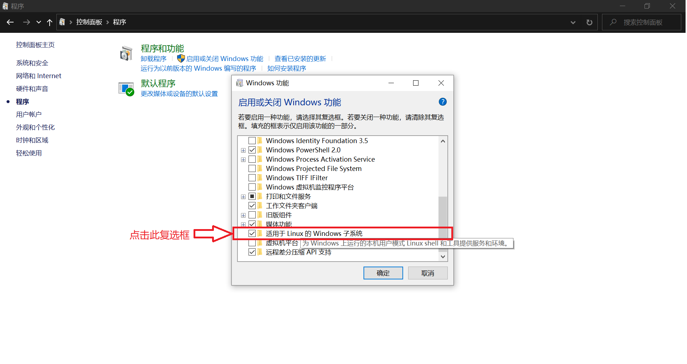
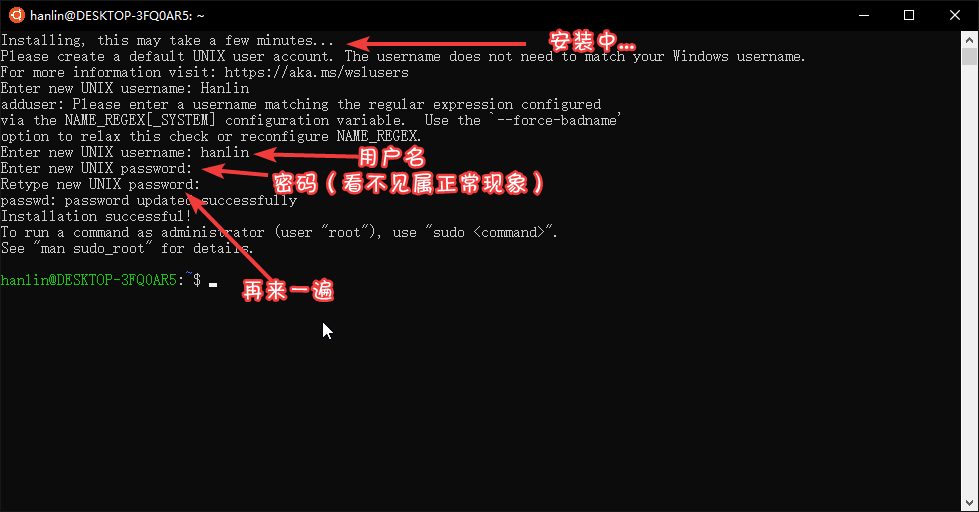
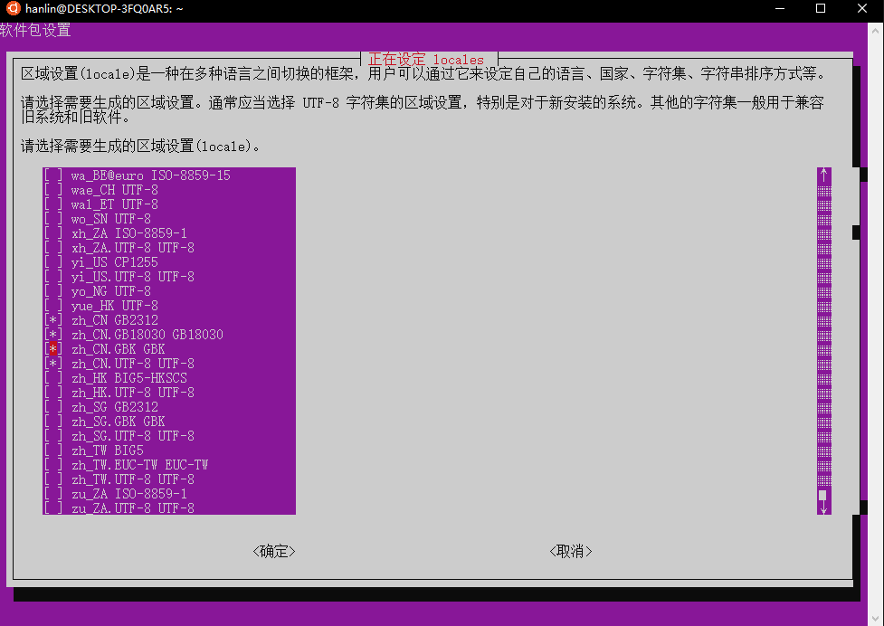
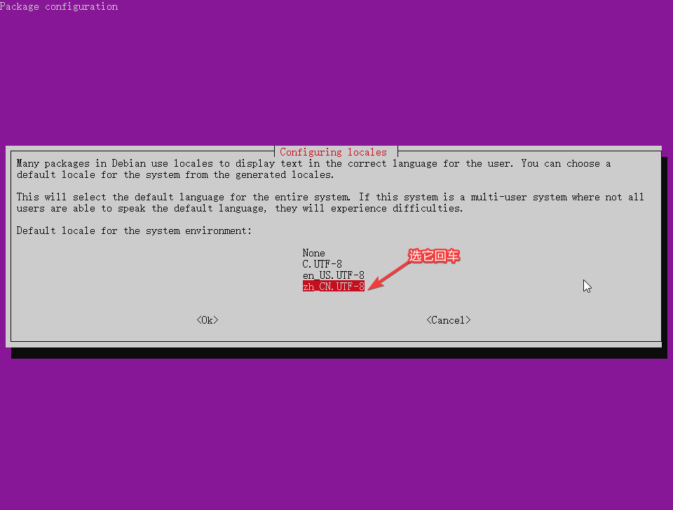
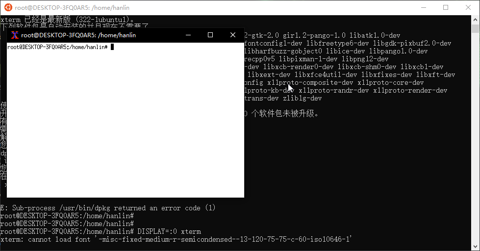
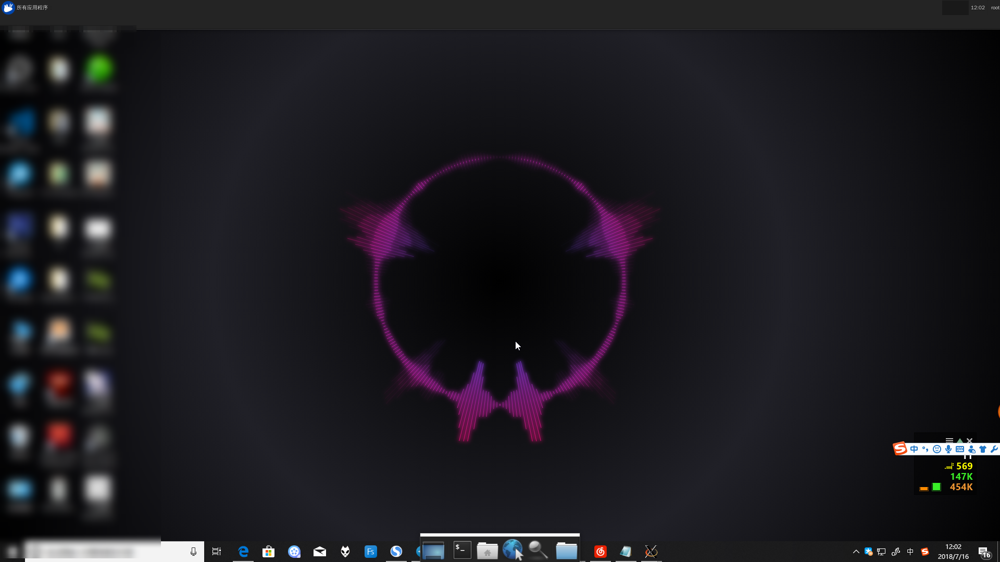
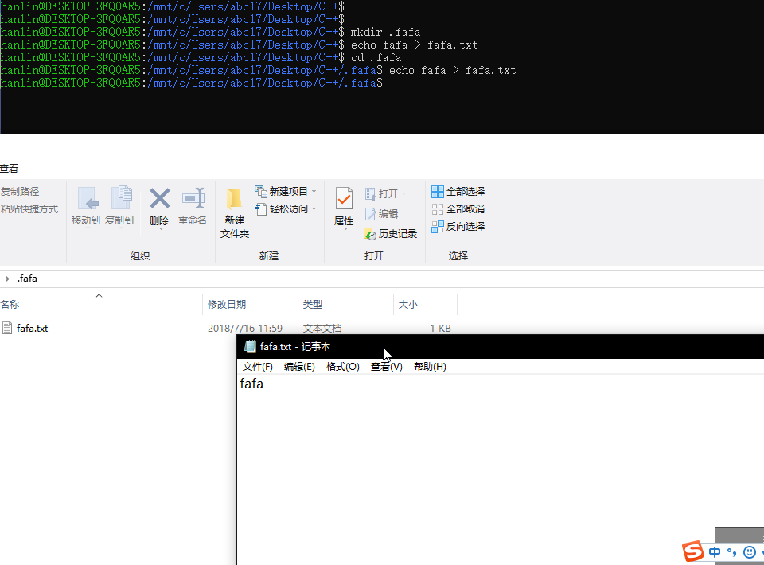

author: Ir1d, H-J-Granger, NachtgeistW, StudyingFather, Enter-tainer, abc1763613206, Anti-Li, shenyouran, Chrogeek, SukkaW, Henry-ZHR, Early0v0, andylizf, tootal, Marcythm


本章主要介绍了在 Windows 系统下运行 Linux 系统的方法。

由于截至 2020 年 6 月，大部分系统尚未安装 Windows 10 2020 年 5 月更新（内部版本 19041），本章仅介绍 WSL。

* * *

## 引言

众所周知，尽管现在大部分学校的竞赛练习环境都是构建 XP 等 Windows 系操作系统，但是在 NOI 系列赛中，早已用上了 NOI Linux 这个 Ubuntu 操作系统的阉割版。

> 
>
>  [NOI 系列官方环境要求](http://www.noi.cn/newsview.html?id=559&hash=E4E249&type=11) 或许大家对自己 Windows 环境下的 Dev-C++ 等都已熟识，但是当场景突然切换到 Linux 的时候，你会不会不知所措？
>
> 「想用<kbd>Ctrl</kbd>+<kbd>C</kbd>复制，结果退出了程序」  
> 「平时 AC 的程序模板到了 Linux 上就 WA」……
>
> 为了防止考场上出现此类尴尬情况，我们必须要提前熟悉下 Linux 系统的操作方法。


虽然 NOI 的官网已经放出了 NOI Linux 的 ISO 镜像，但是如果跑虚拟机的话，配置也相当麻烦，包括激活 VMware，用 VMware 装系统开虚拟机等步骤，且 NOI Linux 默认自带图形界面，无法保证在低配系统上流畅运行。

Windows 10 在一周年更新时推出了 Linux 子系统（WSL），在 2020 年 5 月更新中升级到了 WSL 2。截至 2020 年 6 月 1 日，WSL 已支持安装 Ubuntu、openSUSE Leap、Kali、Debian……等主流 Linux 分发版。但 WSL 并不支持 NOI 评测用的 Arbiter。

???+ note "[Linux 子系统（WSL）](https://zh.wikipedia.org/wiki/%E9%80%82%E7%94%A8%E4%BA%8E_Linux_%E7%9A%84_Windows_%E5%AD%90%E7%B3%BB%E7%BB%9F) "
    适用于 Linux 的 Windows 子系统（英语：Windows Subsystem for Linux，简称 WSL）是一个为在 Windows 10 和 Windows Server 2019 上能够原生运行 Linux 二进制可执行文件（ELF 格式）的兼容层。
    
    WSL 可让开发人员按原样运行 GNU/Linux 环境 - 包括大多数命令行工具、实用工具和应用程序 - 且不会产生虚拟机开销。
    
    WSL 仅在版本 1607 之后的 64 位版本的 Windows 10 中可用。它也可在 Windows Server 2019 中使用。

* * *

## WSL 还是 WSL 2

参见： [比较 WSL 2 和 WSL 1](https://docs.microsoft.com/zh-cn/windows/wsl/compare-versions) 

如果系统已经安装了 2020 年 5 月更新（内部版本 19041）或更高版本，则可以考虑开启 WSL 2。建议权衡自己的需求选择适合的版本。

WSL 的机制，总体上是在运行时将 Linux 系统调用翻译为 NT API 调用，从而在 NT 内核基础之上模拟实现 Linux 内核。

无论是在 ABI 还是 API 层模拟，Linux/UNIX 与 Windows NT 毕竟是两类内核，设计理念、设计标准等多方面差异甚大，无法实现完全对等模仿，WSL 无法兼容所有 Linux System Call，这就造成有的程序无法在 WSL 中运行。

也许是因为 WSL1 靠翻译 System Call 来模拟 Linux 内核存在诸多问题，这种黑科技思路此次被微软完全抛弃。WSL 2采用了虚拟机的技术，仅仅是名字上延续了 WSL，再也不是当初那个 WSL 了。WSL2 引入了修改版的 Linux 内核，基于 Linux 4.19，这也是 Linux 内核的长期支持版，新的内核经过了微软悉心改造，以便与 Windows 相配合，获得更好的用户体验。WSL2 将 Linux 内核塞到一个轻量级的虚拟机（Virtual Machine，VM）中运行，使用体验基本与 WSL1 保持一致。

使用虚拟机的方式带来了运行效率和兼容性两方面的提升。根据微软自己的测试，与 WSL1 相较，在 WSL2 中解压 zip 文档速度提升了 20 倍，使用 git clone、npm install、cmake 提升大约 2~5 倍。由于使用了真正的 Linux 内核，意味着 WSL2 全面兼容 Linux System Call，理论上能在 GNU/Linux 上运行的程序也都能在 WSL2 中不经修改直接运行。

性能方面，WSL 和 WSL2 各有优势。 **如果不和本机系统交互，WSL2 的性能非常不错，但如果访问 Windows 文件系统下的文件，IO 性能会下降很多。** 

如果你经常使用 WSL 来访问 Windows 文件系统上的项目文件，那么建议你使用 WSL 1，因为跨 OS 文件系统具有更高的性能。


传统的虚拟机可能有启动速度慢，消耗大量资源等问题，需要花费时间进行管理。而 WSL 2 没有这些属性。
WSL 2 有 WSL 1 的优点，包括 Windows 和 Linux 之间的无缝集成，启动时间短，资源占用量少，并且无需 VM 配置或管理。虽然 WSL 2 确实使用 VM，但 VM 是在幕后管理和运行的，因此你将具有与 WSL 1 相同的用户体验。

## 启用 WSL

???+ warning
    本部分适用于 Windows 10 秋季创意者更新（内部版本 16215）和更高版本。

在安装适用于 WSL 的任何 Linux 分发版之前，必须在下述两种方法中选择一种，以确保启用“适用于 Linux 的 Windows 子系统”可选功能：

### 使用 Powershell

1.  以管理员身份打开 PowerShell 并运行：

    ```powershell
    Enable-WindowsOptionalFeature -Online -FeatureName Microsoft-Windows-Subsystem-Linux
    ```

2. 出现提示时，重启计算机。

### 使用 GUI



1. 打开“控制面板”

2. 访问“程序和功能”子菜单“打开或关闭 Windows 功能”

3. 选择“适用于 Linux 的 Windows 子系统”

4. 点击确定

5. 重启

## 安装与使用 Ubuntu

本章以 Ubuntu 16.04 LTS 为例。

### 安装


进入 Microsoft Store，搜索 "Ubuntu"，然后选择“Ubuntu”，点击“安装”进行安装。也可打开 <https://www.microsoft.com/zh-cn/p/ubuntu/9nblggh4msv6> 

???+ warning
    Microsoft Store 的 Ubuntu 随着 Ubuntu 的更新而更新，因此内容可能会有所改变。如果想获取稳定的 Ubuntu 长期支持版，可以在 Microsoft Store 安装 Ubuntu 的 LTS 版本。

### 运行 Ubuntu

打开“开始”菜单找到 Ubuntu 并启动，或使用 wsl 命令从 Windows 命令行启动。

可以为 Ubuntu 创建应用程序磁贴或固定至任务栏，以在下次方便地打开。

### 初始化

第一次运行 Ubuntu，需要完成初始化。

等待一两分钟时间，系统会提示创建新的用户帐户及其密码，请确保选择一个容易记住的密码。



## 基础配置

初次安装好的系统不附带任何 C/C++ 编译器，需要手动配置环境。


### 更换为国内软件源

Ubuntu 默认的软件源在国外。可以换成国内的软件源以加快速度，如 [清华 TUNA 的软件源](https://mirrors.tuna.tsinghua.edu.cn/help/ubuntu/) 。

???+ warning  "使用与自己系统版本匹配的软件源"
    请在页面中寻找与自己系统版本相配的源（可使用 `sudo lsb_release -a` 查看 Ubuntu 版本）。
    
    除非你知道你在做什么，否则不要使用与自己的系统版本不匹配的源！

使用以下命令更新软件和软件源：

```bash
sudo cp /etc/apt/sources.list /etc/apt/sources.list.bak
sudo vim /etc/apt/sources.list
# （按 i 之后将上文的源右键粘贴进去，编辑完后按 Esc，再输入 :wq 和回车）
sudo apt update
sudo apt upgrade -y
```


### 安装中文环境

```bash
sudo apt install  language-pack-zh-han* -y
sudo locale-gen zh_CN.GB18030 && sudo locale-gen zh_CN.UTF-8
# 中文字体，别忘了同意 EULA
sudo apt install fontconfig -y
sudo apt install ttf-mscorefonts-installer -y
# 下面的再执行一遍以防万一
sudo apt install -y --force-yes --no-install-recommends fonts-wqy-microhei
sudo apt install -y --force-yes --no-install-recommends ttf-wqy-zenhei
sudo dpkg-reconfigure locales
```

使用 `sudo dpkg-reconfigure locales` 进入菜单，按空格选择带 `zh_CN` 的选项（推荐 `zh_CN, UTF-8 UTF-8` ），选完后回车，



下一个菜单中选择 `zh_CN.UTF-8` 回车。



之后关闭 Ubuntu 并重启，系统就会变成中文。

再依次输入下列命令，把 `man` 帮助页替换为中文。

```bash
sudo apt install manpages-zh
sudo vi /etc/manpath.config
:1,$s#/usr/share/man#/usr/share/man/zh_CN#g
:wq
```

可以用 `man help` 测试。

### 安装编译环境

```bash
sudo apt install build-essential vim ddd gdb fpc emacs gedit anjuta lazarus -y
wget http://download.noi.cn/T/noi/GUIDE-1.0.2-ubuntu.tar
tar -xvf GUIDE-1.0.2-ubuntu.tar
cd GUIDE-1.0.2-ubuntu
chmod +x install.sh && ./install.sh
```

这是基础的 + NOI 官方要求环境，如有需要可以用 `apt install 程序名` 来安装别的。
若想安装其他版本可以参考 [这个](https://www.cnblogs.com/EasonJim/p/7144017.html) 。

以下为一个示例程序：

```bash
$ vim cpuid.cpp
$ g++ -Wall cpuid.cpp -o cpuid
$ ./cpuid
AMD Ryzen 5 1400 Quad-Core Processor
```

???+ note
    Linux 环境下可执行文件可不带扩展名，实现方式看上方命令。

## 进阶操作

### 安装图形环境，并使用远程桌面连接

推荐图形环境用 xfce4，不臃肿。

```bash
sudo apt install xfce4 tightvncserver -y
# 或使用 sudo apt install xubuntu-desktop -y
# xubuntu 安装的软件多，基础环境可用第一种
```

图形环境文件较大，下载解包需要一定时间。

配置 xrdp：

```bash
sudo apt install xrdp -y
echo "xfce4-session" >~/.xsession
sudo service xrdp restart
```

为了防止和计算机本来带的远程桌面冲突，最好换一下端口。


运行命令 `vim /etc/xrdp/xrdp.ini` ，把 `port=3389` 改为其他端口（如 `port=3390` ），然后保存即可。


运行 `sudo service xrdp restart` ，然后去开始菜单，用 `localhost: 配置的端口` 来访问。


### 使用 Xming 连接

进入 Ubuntu 环境，安装 xterm：

```bash
sudo apt-get install xterm -y
```

退出 Ubuntu。

从 <https://sourceforge.net/projects/xming/> 下载最新的 Xming Server，然后安装：


如果安装完后忘记勾选 Launch Xming，需在开始菜单里打开 Xming：


之后再回到 Ubuntu，键入如下指令：

```bash
DISPLAY=:0 xterm
```



貌似只支持命令行。

如果使用了 xfce4，可以在弹出的窗口中使用如下命令激活 xfce4：

```bash
xfce4-session
```


运行结果如图。（在 Xming 中使用<kbd>Ctrl</kbd>+<kbd>C</kbd>就可以退出该界面。）



### 与 Windows 内原硬盘分区交互

硬盘分区作为文件夹在 `/mnt/` 里存放，因此可以直接交互，如直接编译二进制文件，或者往 Ubuntu 里传文件。




## FAQ

参见： [常见问题](https://docs.microsoft.com/zh-cn/windows/wsl/faq) ， [WSL 2 常见问题解答](https://docs.microsoft.com/zh-cn/windows/wsl/wsl2-faq) 

-   如何在子系统下进行 xxx？

    可以用自带命令行，或者使用图形界面。
    比如说 vim，在命令行中键入 `man vim` ，会给出一份详尽的使用方法。
    亦可使用 `vim --help` 。
-   占用量大？

    这个系统和 Windows 10 共用 Host，所以理论上是比虚拟机占用小的。而且只要别装太多应用，应该还是可以带动的。
-   汉语化时提示不存在？

    玄学问题，可以忽略。修了个疏忽导致的错误，可以重上一下试试。

## 参考资料

1.  [洛谷日报 #6](https://www.luogu.com.cn/blog/asfr/Run-Ubuntu-On-Windows10) 
2.  [适用于 Linux 的 Windows 子系统安装指南 (Windows 10), Microsoft Docs](https://docs.microsoft.com/zh-cn/windows/wsl/install-win10) 
3.  [适用于 Linux 的 Windows 子系统，Wikipedia](https://zh.wikipedia.org/zh-hans/%E9%80%82%E7%94%A8%E4%BA%8E_Linux_%E7%9A%84_Windows_%E5%AD%90%E7%B3%BB%E7%BB%9F) 
4.  [WSL-Ubuntu 维基，ubuntu wiki](https://wiki.ubuntu.com/WSL) 
5.  [Windows 10 版本 1803 中命令行的新增功能，Microsoft Devblogs](https://devblogs.microsoft.com/commandline/windows10v1803/) 
6.  [NOIP 标准评测系统及相关问题，smart0326, 2014-05-19, 百度文库](https://wenku.baidu.com/view/8246d96cdd36a32d72758143.html) 
7.  [WSL, 百度百科](https://baike.baidu.com/item/wsl/20359185) 
8.  [Run Bash on Ubuntu on Windows, Mike Harsh, 2016-05-30, Windows Blog](https://blogs.windows.com/buildingapps/2016/03/30/run-bash-on-ubuntu-on-windows/#cie8WdR3uSjgR5Ru.97) 
9.  [Windows Subsystem for Linux Documentation, MSDN](https://docs.microsoft.com/zh-cn/windows/wsl/about) 
10.  [NOI 系列活动标准竞赛环境，2016-11-08, NOI 官网](http://www.noi.cn/2016-11-08-03-42-01) 
11.  [购买 Ubuntu, Microsoft Store](https://www.microsoft.com/zh-cn/p/ubuntu/9nblggh4msv6) 
12.  [Ubuntu 镜像使用帮助，清华 TUNA](https://mirrors.tuna.tsinghua.edu.cn/help/ubuntu/) 
13.  [Ubuntu 的 man 命令帮助如何设置中文版，Frank 看庐山，2017-06-09](https://blog.csdn.net/qq_14989227/article/details/72954523) 
14.  [Xming X Server for Windows, SourceForge](https://sourceforge.net/projects/xming/) 
15.  [Sudo, Wikipedia](https://zh.wikipedia.org/wiki/Sudo) 
16.  [ubuntu 的 man 命令帮助如何设置中文版](https://blog.csdn.net/qq_14989227/article/details/72954523) 

## 延伸内容

-  [Dev on Windows with WSL（在 Windows 上用 WSL 优雅开发）](https://dowww.spencerwoo.com) 

-  [GitHub 上的 Awesome-WSL](https://github.com/sirredbeard/Awesome-WSL) 
