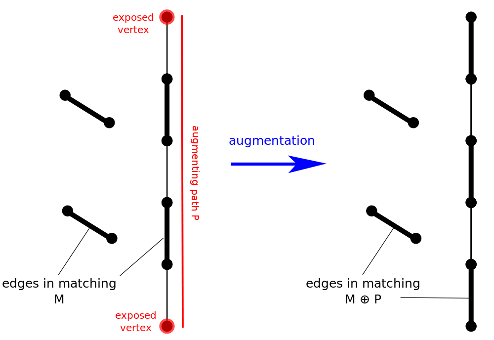

author: accelsao

## 增广路 Augmenting paths

设 $P$ 为图中的一条简单路径且满足：

1.   $P$ 的起点和终点都是未匹配点。
2.   $P$ 经过的边匹配边和未匹配边交错出现。

则称 $P$ 为增广路。
并将满足条件 2 的路径称为 **交错路（alternating path)** 。

增广路（augmenting path）上非匹配边比匹配边数量多一，如果将匹配边改为未匹配边，反之亦然，则匹配大小会增加一且依然是交错路。

### 定理 1

一个匹配 $M$ 是图 $G$ 的最大匹配，如果 $G$ 不存在增广路。

### 证明 1

待补。

!!! 核心思路

    枚举所有未匹配点，找增广路径，直到找不到增广路径。

事实上，对于每个点只要枚举一次就好假设某一轮沿着增广路 $a - b$ 增广后，出现了以 $x$ 为起点的增广路 $P_x$ ，则 $P_x$ 必相交 $a - b$ 。
假设 $P_x$ 第一次碰上 $a - b$ ，由于 $a - b$ 是交错路，意味着相交点是不同类型的（图中以红和蓝表示），
那增广前 $x$ 就能走到 $a - b$ 中的某个未匹配点，说明早已存在从 $x$ 出发的增广路。

## 参考资料

-   [1]2015 年《浅谈图的匹配算法及其应用》- 陈胤伯
-   [2][演算法笔记 - Matching]( <http://www.csie.ntnu.edu.tw/~u91029/Matching.html> )
